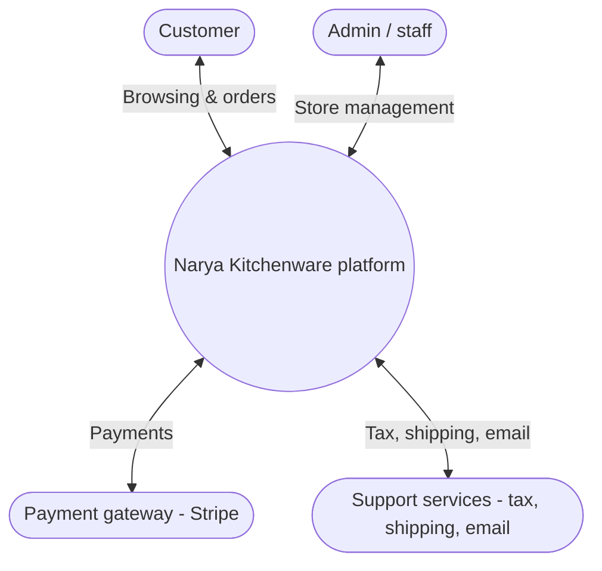
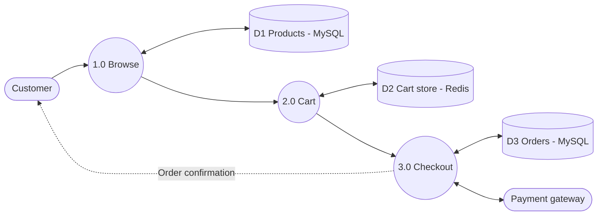
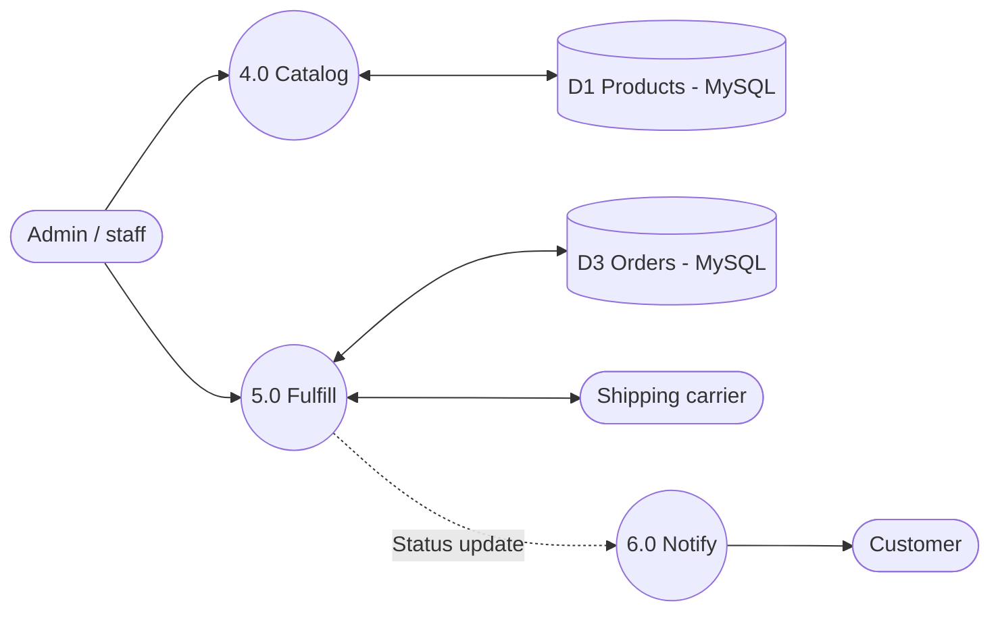
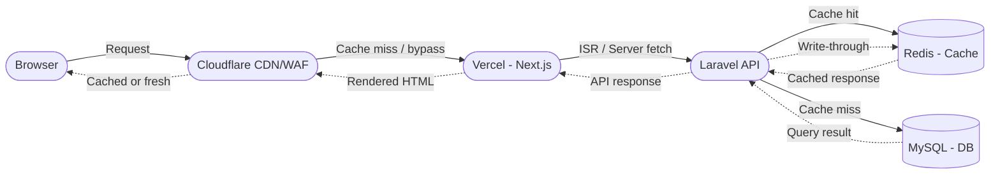

# Data Flow Diagrams — Narya Kitchenware

| | |
|---|---|
| **Document version** | 2.0 |
| **Date** | June 24, 2026 |
| **Companion documents** | `SPEC.md`, `CACHING.md`, `README.md` |

These diagrams render automatically when this file is viewed on GitHub (Mermaid is supported natively in `.md` files). They show the same data flow covered conceptually in `SPEC.md` Sections 8 and 10, in standard DFD form.

**Notation:**
- Rounded/stadium shape — external entity (a person or system outside the platform)
- Circle — process (numbered, matches the function numbers in `SPEC.md` Section 8 where applicable)
- Cylinder — data store (matches the database tables described in `SPEC.md` Section 2)
- Solid arrow — primary data flow
- Dashed arrow — secondary or triggered flow

---

## Level 0 — Context Diagram

The whole platform as a single process, showing everything that crosses the system boundary.

---

## Level 1 — Customer Ordering Flow

Decomposes the customer-facing side of the platform: browsing, cart, and checkout.

**Reading this diagram:** a customer's search hits the product catalog (D1 in MySQL via the Laravel API) directly. Adding to cart reads and writes the Redis-backed cart store (D2) — this is the same store defined in `CACHING.md` Section 6. Checkout creates a row in Orders (D3 in MySQL) and talks to Stripe for payment via the Laravel API, then sends a confirmation back to the customer.

---

## Level 1 — Catalog Management & Order Fulfillment

Decomposes the admin-facing side: keeping the catalog current and getting orders out the door.

**Reading this diagram:** admin actions update the same Products store (D1) the customer flow reads from — this is exactly why `CACHING.md` requires cache invalidation to be wired into every admin save action, not left to a TTL. Order fulfillment (5.0) reads/writes Orders (D3), calls the shipping carrier for rates and labels, and triggers a notification (6.0) that goes out to the customer by email (dispatched via Laravel Queues).

---

## Level 2 — Decoupled Architecture Detail

Shows how the Next.js frontend and Laravel backend interact, and where each cache layer sits in the flow.

**Reading this diagram:** every request passes through Cloudflare first. Cache hits at the Cloudflare edge never reach Vercel. Cache hits at the Next.js ISR layer never call the Laravel API. Cache hits at the Laravel/Redis layer never touch MySQL. Only on a full cache miss does a request travel all the way to the database.

---

## How These Connect to the Rest of the Documentation

- **D1 (Products), D2 (Cart store), D3 (Orders)** map directly to the Laravel/MySQL/Redis architecture in `SPEC.md` Section 2 and the caching layers in `CACHING.md` Section 2. D1 and D3 are MySQL tables managed by Eloquent; D2 is Redis-only (cart data is never persisted to MySQL for guests).
- Any arrow touching **D1 or D3 from an admin action** is exactly the trigger point described in `CACHING.md` Section 7 (on-demand ISR revalidation + Cloudflare purge) — if a new admin feature writes to either store, its cache invalidation must be wired up the same way (via a queued Laravel job).
- The **Payment gateway** and **Shipping carrier** external entities correspond to the Stripe and carrier integrations listed in `SPEC.md` Section 11.
- The **Laravel API** layer is the single entry point for all data writes from the Next.js frontend — Next.js never writes to MySQL or Redis directly.

---

*These are living diagrams — if a future feature changes how data moves through the system (e.g., adding a wholesale/B2B flow per `SPEC.md` Section 18), update the relevant diagram here rather than letting the documentation drift from the actual implementation.*
