# Backend Data Flow Diagram and Admin UI/UX Blueprint

| | |
|---|---|
| **Document version** | 1.0 |
| **Date** | June 26, 2026 |
| **Purpose** | Backend DFD and admin UI/UX blueprint for running Narya Kitchenware without hardcoded business/content settings |
| **Relationship to existing docs** | Additive companion to `DFD.md`, `README.md`, `CACHING.md`, `kitchenware-ecommerce-spec.md`, and `BACKEND_DFD_PHASE_TRACKER.md` |

This document does not replace the existing `DFD.md`. It extends it with a backend-first view based on the current frontend and admin surface in this repo.

Use `BACKEND_DFD_PHASE_TRACKER.md` to execute this DFD in order. That tracker breaks the backend into phases, defines exit gates, and prevents later work from starting before earlier requirements are complete.

The central rule is:

> The frontend may define layout and fallback error states, but store operators must be able to change business data, store content, merchandising, policies, shipping, rewards, promotions, tracking, and operational settings through an authenticated backend UI. Values such as store name, currency, phone number, footer links, homepage slides, sale banners, shipping thresholds, payment labels, rewards rules, and SEO metadata must not remain hardcoded in React components.

---

## 1. Current Frontend Surface That Drives Backend Needs

The current frontend exposes or references these business areas:

| Area | Frontend/admin routes or components | Backend must own |
|---|---|---|
| Storefront home | `HeroCarousel`, `CategoryTiles`, `FlashSale`, product rows, newsletter | Homepage sections, slides, side promos, featured collections, sale windows, product selections, display order |
| Catalog | `/shop`, `/shop/[category]`, `/product/[slug]`, search | Products, variants, images, categories, brands, attributes, tags, stock, reviews |
| Cart and checkout | `/cart`, `/checkout`, `/api/cart`, `/api/orders` | Cart sessions, pricing, discounts, shipping, tax, inventory reservation, order creation |
| Customer account | `/account`, `/orders`, `/wishlist`, auth routes | Profiles, addresses, order history, wishlists, points, default payment method |
| Admin catalog | `/admin/products`, categories, brands, attributes, tags, reviews | Full CRUD, publication state, moderation, image/variant management, cache invalidation |
| Admin sales | `/admin/orders`, customers | Order lifecycle, customer records, refunds, fulfillment, notes, status history |
| Admin promotions | discounts, coupons, affiliates, rewards | Coupon rules, automatic discounts, affiliate attribution, reward earn/redeem rules |
| Admin configuration | shipping, settings | Store identity, currency, locale, contact info, payment methods, shipping rules, tax, legal, SEO, feature flags |
| Static/legal content | about, contact, privacy, terms, shipping returns, guides, recipes | Page content, navigation/footer links, forms, CMS content, publishing workflow |

---

## 2. Level 0 - Backend Context Diagram

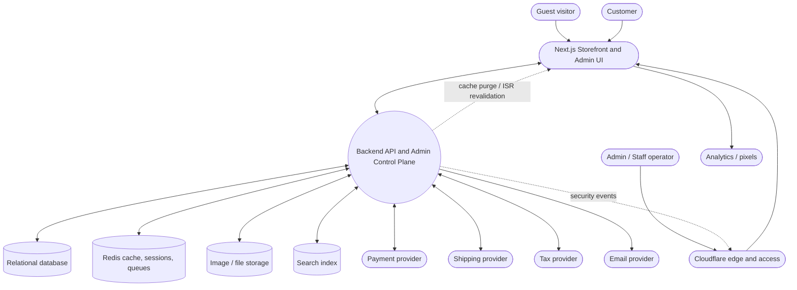

**Boundary rule:** Next.js renders UI and proxies requests, but the backend is the source of truth for all mutable business data. Admin screens call protected backend endpoints. Storefront screens call public or customer-authenticated backend endpoints. The database is never accessed directly from the frontend.

---

## 3. Level 1 - Backend Domains

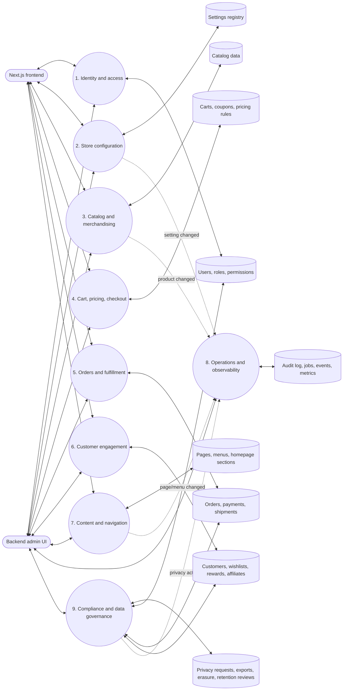

**Backend domains:**

- **Identity and access:** auth, admin login, 2FA, RBAC, user switching/impersonation, staff permissions.
- **Store configuration:** store identity, currency, locale, timezone, contact details, payment settings, shipping defaults, tax settings, feature flags, integration keys by environment.
- **Catalog and merchandising:** products, variants, images, categories, brands, attributes, tags, stock, related products, featured/sale collections.
- **Cart, pricing, checkout:** cart sessions, coupon validation, automatic discounts, reward redemption, affiliate attribution, shipping/tax quotes, checkout validation.
- **Orders and fulfillment:** order creation, payment status, refunds, shipment status, tracking, fulfillment notes, customer notifications.
- **Customer engagement:** accounts, addresses, wishlist, reviews, rewards, affiliates, newsletter leads.
- **Content and navigation:** homepage sections, footer/header links, legal pages, recipes/guides, SEO metadata, announcement bars.
- **Operations and observability:** audit logs, queued jobs, cache invalidation, search indexing, dashboards, health checks, admin activity feed.
- **Compliance and data governance:** privacy requests, data export, customer erasure/anonymization, retention review, and evidence trail.

---

## 4. Level 2 - Editable Configuration Flow

This flow is the answer to "nothing should be hardcoded."

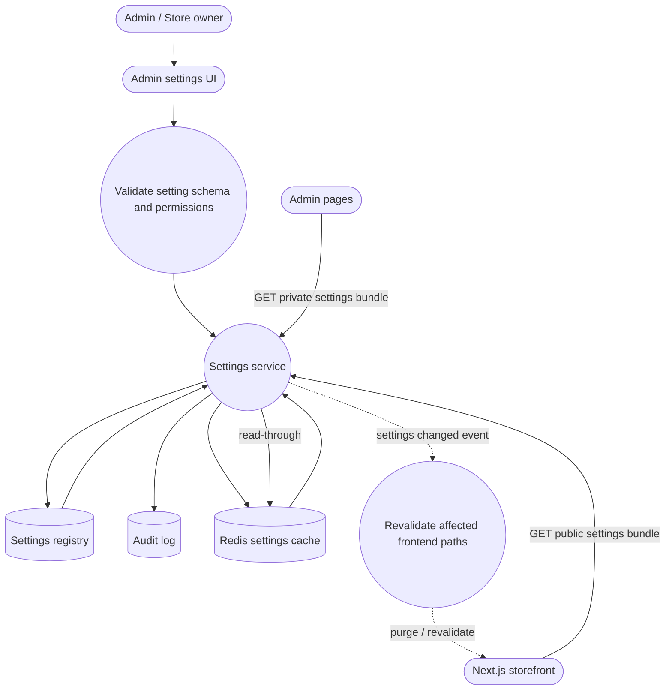

### Settings Registry Requirements

Every configurable value should have a typed registry entry:

| Field | Purpose |
|---|---|
| `key` | Stable machine key, e.g. `store.currency`, `homepage.hero.slides`, `shipping.free_threshold` |
| `value` | JSON value, encrypted value, or normalized relation depending on setting type |
| `type` | `string`, `number`, `boolean`, `money`, `json`, `image`, `url`, `secret`, `rich_text`, `relation` |
| `group` | Admin UI grouping: Store, Homepage, Checkout, Shipping, Payments, SEO, Legal, Integrations |
| `scope` | `public`, `admin`, `secret`, `environment` |
| `environment` | `local`, `staging`, `production`, or `all` |
| `validation_schema` | Backend-enforced validation rules |
| `default_value` | Safe default used only when no value exists |
| `updated_by` | Staff user who changed it |
| `updated_at` | Last update timestamp |

**Important:** Defaults may exist in migrations/seeders for first setup, but runtime components should fetch settings from the backend and should not embed business values directly.

---

## 5. Level 2 - Storefront Read Flow

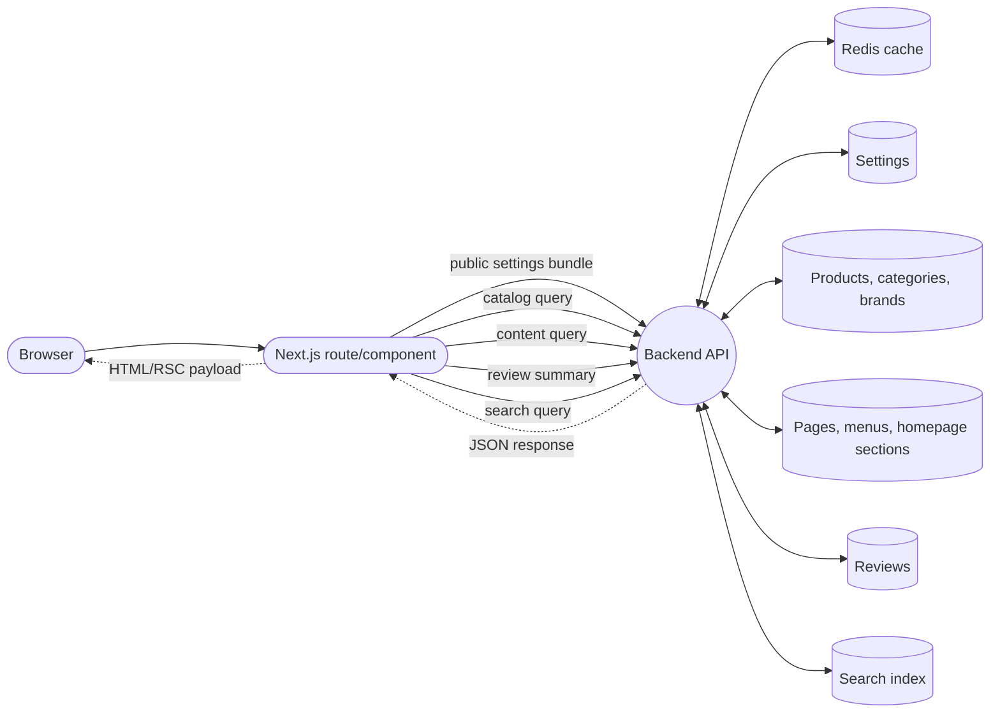

### Public Settings Bundle

The frontend should request a public settings bundle for layout and store behavior:

- Store name, logo, tagline, phone, email, physical address, social links.
- Currency, locale, timezone, money formatting.
- Header menu, footer columns, footer text, legal links.
- Payment method display labels and enabled state.
- Shipping messages such as free shipping threshold and delivery estimate.
- Homepage section order and section content.
- Announcement bars, promo side cards, feature flags.
- SEO defaults and structured-data organization fields.

Secret values such as API keys must never appear in this bundle.

---

## 6. Level 2 - Admin UI/UX Information Architecture

The backend admin should be a control plane, not only a data table collection.

```mermaid
flowchart TB
  Dashboard[Dashboard]

  Dashboard --> Setup[Store Setup Wizard]
  Dashboard --> Catalog[Catalog]
  Dashboard --> Sales[Sales]
  Dashboard --> Promotions[Promotions]
  Dashboard --> Content[Content and Navigation]
  Dashboard --> Customers[Customers]
  Dashboard --> Configuration[Configuration]
  Dashboard --> Operations[Operations]

  Setup --> SetupIdentity[Store identity]
  Setup --> SetupPayments[Payments]
  Setup --> SetupShipping[Shipping]
  Setup --> SetupLegal[Legal pages]
  Setup --> SetupLaunch[Launch checklist]

  Catalog --> Products[Products]
  Catalog --> Categories[Categories]
  Catalog --> Brands[Brands]
  Catalog --> Attributes[Attributes]
  Catalog --> Tags[Tags]
  Catalog --> Reviews[Reviews moderation]
  Catalog --> Inventory[Inventory]

  Sales --> Orders[Orders]
  Sales --> Refunds[Refunds]
  Sales --> Fulfillment[Fulfillment]
  Sales --> Reports[Sales reports]

  Promotions --> Discounts[Automatic discounts]
  Promotions --> Coupons[Coupons]
  Promotions --> FlashSales[Flash sales]
  Promotions --> Rewards[Rewards]
  Promotions --> Affiliates[Affiliates]

  Content --> Homepage[Homepage builder]
  Content --> Menus[Header and footer menus]
  Content --> Pages[Pages]
  Content --> Recipes[Recipes]
  Content --> Guides[Guides]
  Content --> SEO[SEO metadata]

  Configuration --> StoreSettings[Store settings]
  Configuration --> CheckoutSettings[Checkout settings]
  Configuration --> PaymentSettings[Payment methods]
  Configuration --> ShippingSettings[Shipping rules]
  Configuration --> TaxSettings[Tax rules]
  Configuration --> Integrations[Integrations]
  Configuration --> FeatureFlags[Feature flags]

  Operations --> Activity[Audit activity]
  Operations --> Jobs[Queue jobs]
  Operations --> Cache[Cache and revalidation]
  Operations --> SearchOps[Search indexing]
  Operations --> Health[System health]
```

### Backend Admin UX Principles

- **Dashboard first:** show revenue, orders, low stock, pending reviews, failed jobs, setup checklist, recent activity.
- **Setup wizard:** guide a new operator through required setup before launch: store identity, payment, shipping, tax, legal pages, products, admin security.
- **Preview before publish:** homepage, menus, pages, emails, coupons, and flash sales should support draft/preview/publish states where practical.
- **Audit every write:** every admin mutation writes an audit event with actor, old value, new value, affected entity, IP/user agent, and timestamp.
- **Bulk actions with confirmation:** products, orders, reviews, coupons, and customers need bulk actions, but destructive actions require confirmation and permission checks.
- **Role-aware navigation:** Admin sees everything; Shop Manager sees catalog/orders/promotions; Editor sees content; Support sees customers/orders; Finance sees refunds/reports.
- **Inline validation:** backend validation errors should map to specific form fields. No generic "failed" message for operator mistakes.
- **Operational visibility:** failed payment webhooks, failed emails, failed cache purges, and failed search indexing should be visible and retryable.

---

## 7. Level 3 - Homepage and Content Management Flow

The current homepage has hardcoded slides, side promos, category tiles, footer links, and some sale messaging. These should move to backend-managed content and settings.

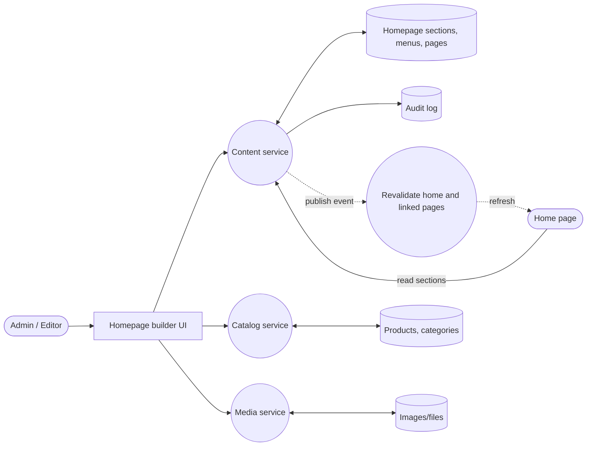

### Homepage Builder Data Model

| Entity | Example fields |
|---|---|
| `homepage_sections` | `id`, `type`, `title`, `status`, `sort_order`, `visibility_rules`, `starts_at`, `ends_at` |
| `hero_slides` | `eyebrow`, `heading`, `subheading`, `cta_label`, `cta_href`, `theme`, `image_id`, `sort_order` |
| `promo_cards` | `label`, `description`, `action_label`, `href`, `icon`, `color`, `sort_order` |
| `category_tiles` | `category_id`, `label_override`, `theme`, `image_id`, `sort_order`, `is_visible` |
| `featured_product_rows` | `title`, `source_type`, `manual_product_ids`, `category_id`, `tag_id`, `limit`, `sort_rule` |
| `flash_sales` | `title`, `starts_at`, `ends_at`, `discount_rule_id`, `product_ids`, `is_active` |
| `menus` | `location`, `label`, `href`, `parent_id`, `sort_order`, `is_visible` |
| `pages` | `slug`, `title`, `body`, `seo_title`, `seo_description`, `status` |

---

## 8. Level 3 - Catalog Management Flow

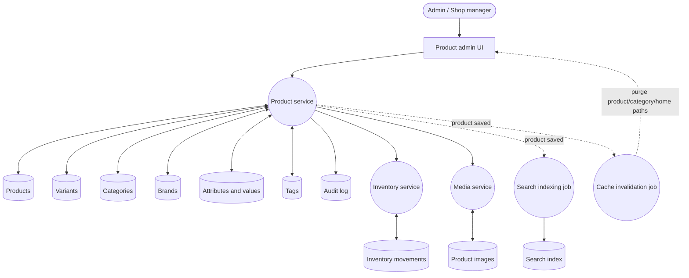

### Required Catalog UI/UX

- Product list with filters for status, category, brand, stock state, featured, sale, tag, and search.
- Product editor tabs: Basics, Pricing, Inventory, Images, Variants, Attributes, SEO, Related Products, Publishing.
- Image manager with primary image selection, alt text, sort order, and object storage upload.
- Variant matrix for size/color/material/capacity with per-variant SKU, price override, stock, image, and active state.
- Stock movements rather than silent stock edits for auditability.
- Draft, active, archived product states.
- Cache/search reindex status visible after save.

---

## 9. Level 3 - Cart, Checkout, Pricing, and Order Creation Flow

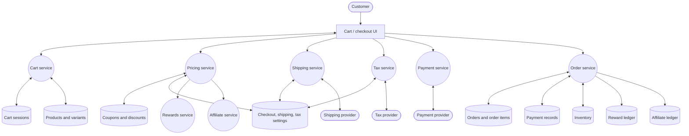

### Checkout Configuration UI

The backend admin should provide screens for:

- Enabled payment methods and labels: card, M-Pesa, bank transfer, cash on delivery, crypto if supported.
- Payment provider credentials by environment, stored as secrets.
- Shipping zones, methods, rates, free shipping thresholds, pickup locations, delivery estimate copy.
- Tax rules by region or tax provider configuration.
- Checkout field requirements: phone required, county required, postal code optional, business name optional.
- Order numbering format.
- Tip settings if tips remain supported.
- Backorder rules and stock reservation timeout.
- Guest checkout enabled/disabled.
- Affiliate attribution window and reward earn/redeem settings.

---

## 10. Level 3 - Order Operations Flow

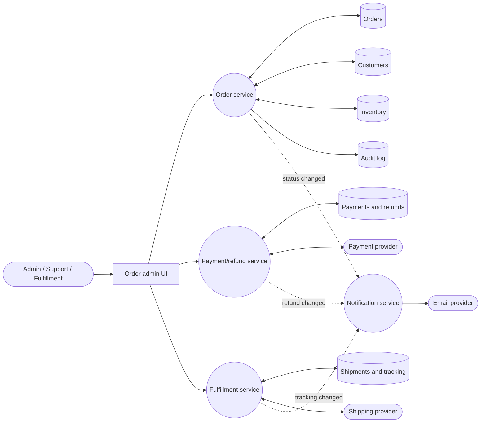

### Required Order Admin UI/UX

- Order list filters: status, payment status, shipping method, date range, customer, high value, unfulfilled.
- Order detail: customer, addresses, items, pricing breakdown, payment history, shipment history, notes, audit timeline.
- Controlled status transitions: pending -> processing -> shipped -> delivered; cancellation/refund paths require reason.
- Partial/full refund workflow with permission checks.
- Tracking number and carrier update workflow.
- Customer notification toggle per update.
- Internal notes separated from customer-visible notes.

---

## 11. Level 3 - Promotions, Rewards, and Affiliates Flow

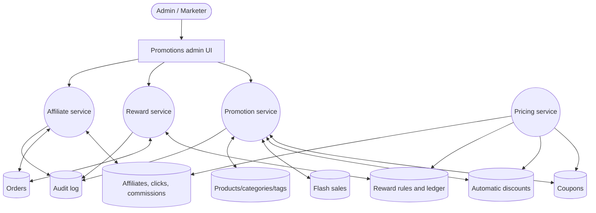

### Promotions Admin UI/UX

- Coupon builder: code, type, value, usage limits, eligible products/categories/customers, start/end dates.
- Automatic discount builder: conditions, stacking rules, priority, active window.
- Flash sale scheduler: products, discount, display section, start/end, countdown visibility.
- Rewards settings: earn rate, redemption rate, minimum redemption, expiry, sign-up bonus, birthday bonus if needed.
- Affiliate settings: commission rate, cookie duration, approval workflow, payout threshold.
- Conflict warnings when promotions overlap or stack unexpectedly.

---

## 12. Level 3 - Auth, Roles, and Security Flow

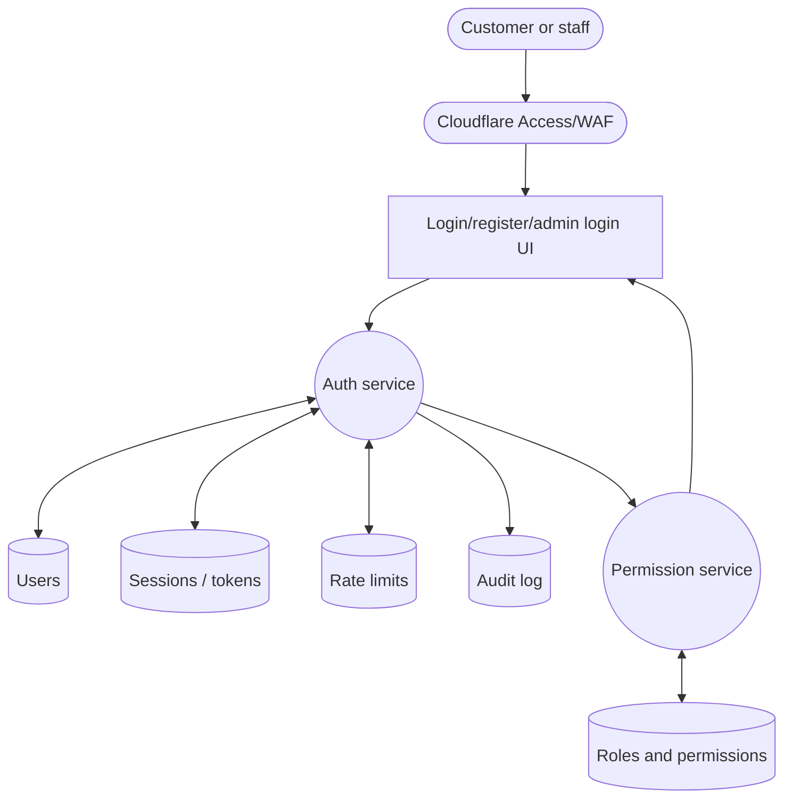

### Required Roles

| Role | Access |
|---|---|
| Admin | Full access, staff management, integrations, secrets, destructive actions |
| Shop Manager | Products, inventory, orders, customers, promotions except financial settings |
| Editor | Homepage, pages, menus, recipes, guides, SEO, reviews moderation |
| Support | Orders, customers, refunds if granted, internal notes |
| Finance | Payments, refunds, reports, taxes, payout/export views |
| Customer | Storefront account only |

All admin writes require server-side authorization. Frontend hiding of buttons is helpful UX, not security.

---

## 13. Data Stores

| Store | Contents | Notes |
|---|---|---|
| `users` | customers and staff | Includes role, email verification, defaults |
| `roles`, `permissions`, `role_user` | RBAC | Can use explicit tables or a package-backed schema |
| `settings` | typed settings registry | Public/admin/secret scoped configuration |
| `products`, `product_variants`, `product_images` | catalog | Product and variant source of truth |
| `categories`, `brands`, `attributes`, `tags` | catalog taxonomy | Drives frontend filters and navigation |
| `inventory_movements` | stock audit | Adjustments, purchases, reservations, returns |
| `reviews` | product reviews | Moderation state and customer/product relation |
| `carts`, `cart_items` | cart sessions | Guest carts use session key; customer carts attach to user |
| `coupons`, `discount_rules` | promotions | Validated by Pricing service |
| `orders`, `order_items` | orders | Immutable item snapshots after purchase |
| `payments`, `refunds` | payment state | Provider IDs and webhook history |
| `shipments` | fulfillment | Carrier, tracking, labels, status |
| `customers`, `addresses`, `wishlists` | customer data | Customer profile and saved data |
| `reward_rules`, `reward_ledger` | rewards | Points balance derived from ledger |
| `affiliates`, `affiliate_clicks`, `affiliate_commissions` | affiliate program | Attribution and payouts |
| `pages`, `menus`, `homepage_sections` | content | Replaces hardcoded page/menu/home content |
| `media_assets` | uploaded files | Stored in S3/R2, metadata in DB |
| `audit_logs` | admin/system activity | Append-only |
| `operational_incidents` | post-launch incidents | Created by monitor command and resolved by admin workflow |
| `data_privacy_requests` | privacy governance | Export, erasure, and retention review workflow evidence |
| `jobs`, `failed_jobs` | queues | Laravel queue/Horizon or equivalent |
| `webhook_events` | idempotency and debugging | Stripe/shipping/tax/provider webhooks |

---

## 14. API Surface Required by the Frontend

### Public Storefront APIs

| Endpoint family | Purpose |
|---|---|
| `GET /api/v1/settings/public` | Public settings bundle for store identity, layout, enabled features |
| `GET /api/v1/homepage` | Published homepage sections and content |
| `GET /api/v1/menus?location=header/footer` | Dynamic navigation and footer links |
| `GET /api/v1/products` | Product listing with filters/sort/pagination |
| `GET /api/v1/products/{slug}` | Product detail |
| `GET /api/v1/categories` | Category tree and category pages |
| `GET /api/v1/search` | Product/content search |
| `GET /api/v1/pages/{slug}` | Legal, about, contact, guide pages |
| `GET /api/v1/reviews` | Approved review summaries |

### Customer APIs

| Endpoint family | Purpose |
|---|---|
| `POST /api/v1/auth/register`, `POST /api/v1/auth/login`, `POST /api/v1/auth/logout` | Auth |
| `GET/PATCH /api/v1/profile` | Customer profile |
| `GET/POST/PATCH/DELETE /api/v1/cart` | Cart |
| `POST /api/v1/checkout/quote` | Price/shipping/tax quote |
| `POST /api/v1/orders` | Create order |
| `GET /api/v1/orders` and `GET /api/v1/orders/{orderNumber}` | Order history/detail |
| `GET/POST/DELETE /api/v1/wishlist` | Wishlist |
| `POST /api/v1/rewards/redeem` | Reward redemption |

### Admin APIs

| Endpoint family | Purpose |
|---|---|
| `GET/POST /api/v1/admin/settings` | Read/update settings registry |
| `GET/POST/PATCH/DELETE /api/v1/admin/products` | Product CRUD |
| `POST/PATCH/DELETE /api/v1/admin/products/{id}/images` | Product image management |
| `POST/PATCH/DELETE /api/v1/admin/products/{id}/variants` | Variant management |
| `GET/POST/PATCH/DELETE /api/v1/admin/categories` | Category CRUD |
| `GET/POST/PATCH/DELETE /api/v1/admin/brands` | Brand CRUD |
| `GET/POST/PATCH/DELETE /api/v1/admin/attributes` | Attribute CRUD |
| `GET/POST/PATCH/DELETE /api/v1/admin/tags` | Tag CRUD |
| `GET/PATCH /api/v1/admin/reviews` | Review moderation |
| `GET/PATCH /api/v1/admin/orders` | Order operations |
| `GET/PATCH /api/v1/admin/customers` | Customer management |
| `GET/POST/PATCH/DELETE /api/v1/admin/coupons` | Coupon CRUD |
| `GET/POST/PATCH/DELETE /api/v1/admin/discounts` | Automatic discount CRUD |
| `GET/POST/PATCH/DELETE /api/v1/admin/affiliates` | Affiliate management |
| `GET/POST/PATCH /api/v1/admin/rewards` | Reward rules |
| `GET/POST/PATCH/DELETE /api/v1/admin/homepage` | Homepage builder |
| `GET/POST/PATCH/DELETE /api/v1/admin/menus` | Header/footer menu builder |
| `GET/POST/PATCH/DELETE /api/v1/admin/pages` | Page/content CMS |
| `GET /api/v1/admin/audit-log` | Activity timeline |
| `GET/POST/PATCH /api/v1/admin/privacy-requests` | Customer data export, erasure, and retention review workflow |
| `GET/PATCH /api/v1/admin/operations/incidents` | Operational incident monitoring and resolution |
| `POST /api/v1/admin/cache/revalidate` | Manual cache revalidation |
| `POST /api/v1/admin/search/reindex` | Manual search reindex |

---

## 15. Level 3 - Compliance, Privacy, and Retention Flow

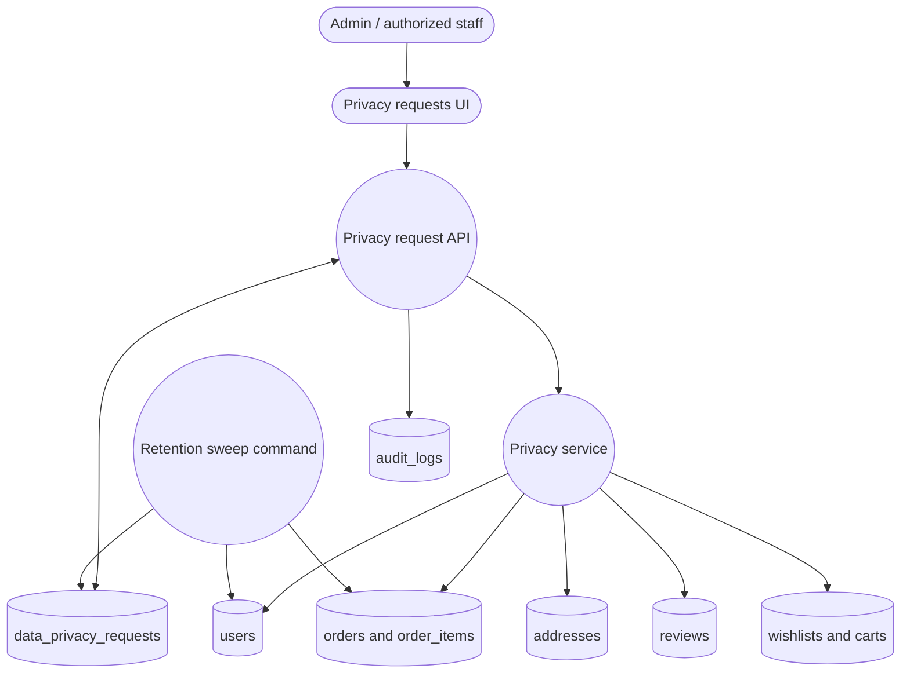

**Governance rules:**

- Export requests collect customer-owned account, address, order, wishlist, review, and reward data while excluding password and remember-token fields.
- Erasure requests anonymize user identity and delete or scrub customer-controlled PII while preserving order history for accounting, fulfillment, fraud, tax, and support needs.
- Required schema fields must receive redacted placeholders rather than invalid nulls.
- Retention reviews are created idempotently from inactivity rules so staff can review old accounts without duplicate work.
- Every admin privacy action must be audited with actor, subject, action, timestamp, and result.

---

## 16. Cache, Revalidation, and Events

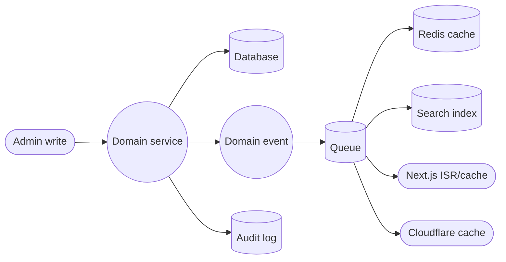

| Event | Trigger | Required effects |
|---|---|---|
| `ProductSaved` | product/variant/image/category/brand/tag changed | Refresh product/category/search/home caches; reindex search |
| `InventoryChanged` | stock adjustment/order/refund | Refresh product stock and low-stock dashboard |
| `SettingChanged` | store/payment/shipping/SEO setting changed | Refresh public settings bundle and affected pages |
| `HomepagePublished` | homepage section/menu/page changed | Revalidate home/menu/page paths |
| `CouponChanged` | coupon/discount changed | Refresh pricing cache |
| `OrderStatusChanged` | order workflow update | Send notification, update dashboard, audit |
| `ReviewModerated` | review approved/rejected | Refresh product review summary |

Admin routes, account routes, cart routes, checkout routes, and personalized data must not be publicly cached.

---

## 17. Backend UI Screens to Build or Upgrade

### Dashboard

- At a glance: products, orders, customers, revenue, pending reviews, low stock, failed jobs.
- Recent orders and activity timeline.
- Store setup checklist driven by real settings state.
- Quick actions: add product, create coupon, edit homepage, view failed jobs.
- Backend control-plane route: `/admin/control-plane` for cross-module store operation and governance.
- The backend control plane exposes visible tabs for overview, catalog, orders, content, promotions, reports, operations, settings, notifications, privacy, and incidents.
- Catalog tab must support category creation, product creation, product status/pricing/featured/low-stock edits, and auditable stock movements with reason and note.
- Orders tab must support status/payment updates with internal reason notes, customer/internal order notes, and shipment creation with carrier/tracking data.
- Content tab must support page creation and homepage section creation with typed section payloads, visibility, status, and sort order.
- Promotions tab must support coupon creation and automatic discount rule creation with stackability, priority, minimum order, and active state.
- Operations tab must expose failed jobs, webhook events, audit activity, recent inventory movements, and auditable cache-clearing actions.

### Store Setup Wizard

1. Store identity: name, logo, tagline, phone, email, address, social links.
2. Localization: currency, locale, timezone, measurement units.
3. Payments: enable methods, provider credentials, test transaction status.
4. Shipping: zones, rates, pickup, free threshold, delivery estimate text.
5. Tax: provider or manual tax rules.
6. Legal: privacy, terms, shipping/returns, refund policy.
7. Launch checklist: products, payment, shipping, legal, security, tracking.

### Settings

Replace read-only settings with editable grouped forms:

- Store identity
- Localization
- Checkout
- Payment methods
- Shipping and delivery
- Tax
- SEO defaults
- Integrations
- Feature flags
- Security
- Email templates

### Homepage Builder

- Drag/drop or ordered section list.
- Section types: hero carousel, side promos, category tiles, product row, flash sale, newsletter, rich text/banner.
- Manual product/category selection and dynamic sources.
- Schedule visibility.
- Preview draft before publish.

### Content and Navigation

- Header menu and footer column builder.
- Page editor for about, contact, privacy, terms, shipping returns, guides.
- SEO fields and Open Graph image.
- Contact form recipient/routing settings.

### Operations

- Audit log.
- Queue jobs and failed jobs.
- Cache revalidation dashboard.
- Search indexing dashboard.
- Webhook event log.
- System health checks.
- Operational incident list and resolution workflow.

### Compliance and Privacy

- Privacy request queue with filters by type, status, subject, and due date.
- Create export or erasure request for a customer from the customer profile.
- Process pending requests with clear completion state and audit evidence.
- View export result metadata and handoff status without exposing secrets.
- Retention review queue generated by the backend sweep command.
- Compliance dashboard showing overdue privacy requests and inactive-customer review volume.

### Notifications

- Notification template list grouped by audience and channel.
- Editable subject and body with allowed variable chips.
- Enable/disable controls per template.
- Test-send workflow with notification log and audit evidence.
- Dispatch logs for queued and disabled notifications.

---

## 18. Hardcoded Frontend Values to Move Behind Backend Control

| Current kind of hardcoding | Backend replacement |
|---|---|
| Hero slides, CTA labels, CTA hrefs, colors | Homepage builder: `hero_slides` |
| Side promo cards and phone number | Homepage builder + public settings |
| Category tile labels, order, themes | Category tile section linked to categories |
| Footer shop/learn/company links | Menu builder by `footer_shop`, `footer_learn`, `footer_company` locations |
| Store tagline/footer copy | Public settings: `store.tagline`, `footer.description` |
| "Secure payments via Stripe" | Payment settings: enabled provider display label |
| Store name/currency/country/timezone read-only fields | Editable settings registry |
| Free shipping threshold text | Shipping settings |
| Flash sale title/products/end date | Flash sale scheduler |
| Product row selections | Merchandising collection rules |
| Static legal/about/contact text | Page CMS |
| Rewards earn/redeem rules | Rewards settings |
| Affiliate attribution/cookie logic | Affiliate settings |

---

## 19. Implementation Sequencing Recommended by This DFD

1. Build the settings registry and admin settings UI first.
2. Add public settings and menu APIs, then replace hardcoded store identity/footer/navigation values.
3. Add homepage/content management APIs, then replace hardcoded home sections.
4. Complete catalog CRUD and product image/variant/inventory workflows.
5. Complete checkout configuration, shipping/tax/payment settings, and pricing service.
6. Complete order operations, refunds, fulfillment, notifications, and audit timeline.
7. Complete promotions, rewards, affiliates, reports, and operational dashboards.
8. Wire all admin writes to audit logging, cache invalidation, search indexing, and revalidation.
9. Add post-launch monitoring, privacy governance, erasure/export workflows, and retention review automation.

This order makes the backend useful as a store control panel early, then progressively removes hardcoded content from the frontend.

---

## 20. Acceptance Criteria

The backend is considered aligned with this DFD when:

- A store operator can change store name, logo, tagline, contact info, currency, timezone, payment labels, shipping copy, footer links, homepage slides, category tiles, flash sales, legal pages, rewards rules, coupons, affiliates, and SEO defaults without editing code.
- Every admin write is validated server-side and authorization-checked server-side.
- Every admin write creates an audit log entry.
- Public frontend pages read content/configuration from backend APIs or generated cache, not from hardcoded arrays.
- Secret settings are encrypted and never sent to public frontend bundles.
- Cache invalidation and search reindexing run automatically after relevant admin writes.
- Admin UX exposes setup state, failed jobs, webhook failures, and cache/search operations.
- Admin UX exposes privacy requests, data export, erasure/anonymization, retention review, and incident response workflows.
- Customer, cart, checkout, account, and admin responses are never publicly cached.

---

## 21. Summary

This backend DFD turns the existing frontend into an operator-run commerce system. The backend should not only store products and orders; it should control the store. The admin UI becomes the place where the business owner configures content, commerce rules, shipping, payments, promotions, legal pages, SEO, and operations without code changes.
