# Backend DFD Phase Tracker

| | |
|---|---|
| **Document version** | 1.0 |
| **Date** | June 26, 2026 |
| **Companion document** | `BACKEND_DFD.md` |
| **Purpose** | Step-by-step backend DFD execution tracker so no phase is skipped or treated as complete before its requirements are exhausted |

This document converts the backend DFD into ordered phases. Do not start a later phase until the previous phase gate is complete and signed off.

Status key:

- `[ ]` Not started
- `[~]` In progress
- `[x]` Complete
- `[!]` Blocked

---

## Phase Control Rules

1. **No phase jumping:** a phase can start only after the previous phase has passed its exit gate.
2. **No hidden hardcoding:** any value visible to customers or store operators must be editable through backend data or settings unless it is purely structural UI.
3. **Backend owns business rules:** frontend components can render and validate for UX, but final validation, pricing, permissions, and persistence belong to the backend.
4. **Every admin write is audited:** if a staff user changes data, the backend records actor, timestamp, changed entity, old value, new value, and source request context.
5. **Every publishable change invalidates caches:** product, content, setting, promotion, and menu changes must trigger revalidation/search/cache work.
6. **Each phase needs proof:** tests, screenshots, API responses, admin UI checks, or documented verification notes must be attached before sign-off.

---

## Phase Overview

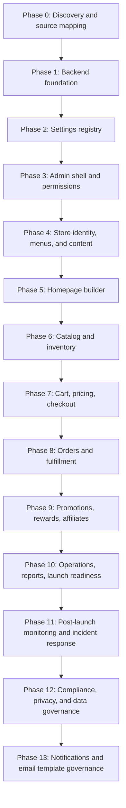

---

## Phase 0 - Discovery and Source Mapping

**Goal:** establish exactly what the frontend currently needs from the backend and identify every hardcoded value that must move to admin control.

### DFD Step

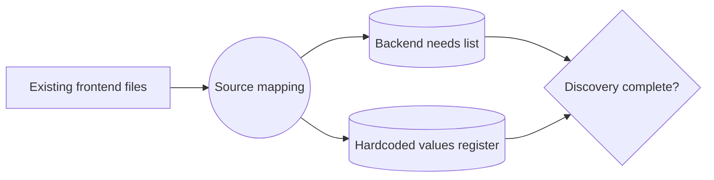

### Checklist

- [ ] Map all storefront pages and components that render business content.
- [ ] Map all admin pages and the API endpoints they call.
- [ ] List all hardcoded homepage values: slides, side promos, CTAs, sale text, category tiles.
- [ ] List all hardcoded layout values: footer links, contact details, store tagline, payment label.
- [ ] List all hardcoded commerce values: currency, country, timezone, shipping messages, checkout defaults.
- [ ] List all current backend API proxy routes in `app/api`.
- [ ] Confirm which data is already available from backend endpoints.
- [ ] Confirm which data is missing and must be added.
- [ ] Create a hardcoded-values removal tracker.

### Exit Gate

- [ ] A source map exists.
- [ ] A hardcoded-values register exists.
- [ ] Every frontend/admin surface is assigned to a backend domain from `BACKEND_DFD.md`.
- [ ] Stakeholder confirms the scope before backend build phases begin.

---

## Phase 1 - Backend Foundation

**Goal:** establish the backend architecture, data access, API shape, auth baseline, validation pattern, and environment separation.

### DFD Step

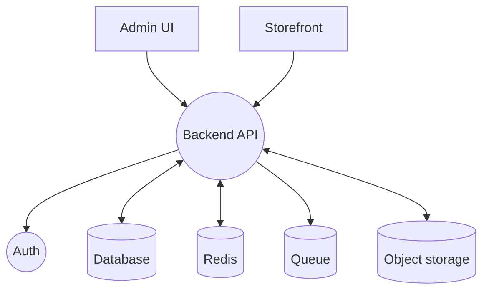

### Checklist

- [x] Backend repo/app exists at `C:\Users\Convenience\narya-backend`.
- [x] Database connection configured per environment. Verified with `php artisan config:show database.default`.
- [~] Redis configured for cache, queues, and sessions/cart where applicable. `.env.example` includes Redis settings, but local defaults currently use database-backed cache/queue/session.
- [x] Object storage configured for media. `.env.example` defines `FILESYSTEM_DISK=local` for local development.
- [x] API version prefix established, e.g. `/api/v1`. Verified with `php artisan route:list --path=api/v1 --except-vendor`.
- [x] Standard JSON success/error response format established. Verified by `test_api_validation_errors_use_message_and_errors_envelope`.
- [x] Request validation pattern established. Existing Form Requests include auth and order validation.
- [x] Auth middleware established. `/api/v1` protected routes use `auth:sanctum`.
- [x] Authorization policy/gate pattern established. Admin APIs use server-side `role:admin,shop_manager` middleware.
- [x] Audit log table/model/service created in backend app.
- [x] Queue worker configured. Verified with `php artisan config:show queue.default`.
- [x] Failed jobs visible and retryable. Verified by `test_database_queue_can_process_fail_and_retry_jobs`.
- [x] Environment variables documented and not committed. Verified `.env.example` contains DB/cache/queue/session/storage defaults.

### Exit Gate

- [x] Health endpoint passes. Verified by `tests/Feature/Foundation/AuditLogFoundationTest.php`.
- [x] Authenticated test endpoint passes. Verified by existing `/api/v1/auth/me` use in `tests/Feature/Foundation/AuditLogFoundationTest.php`.
- [x] Validation error format confirmed. Verified by `test_api_validation_errors_use_message_and_errors_envelope`.
- [x] Audit write can be created by a test admin action. Verified by `test_admin_setting_update_creates_audit_log_entry`.
- [x] Queue job can be dispatched, processed, failed, and retried. Verified by `test_database_queue_can_process_fail_and_retry_jobs`.
- [x] Phase 1 production runbook exists at `C:\Users\Convenience\narya-backend\docs\phase-1-foundation-runbook.md`.
- [x] `.env.example` documents production queue, cache, session, object storage, queue worker, and scheduler runtime requirements.
- [~] Production deployment verification pending. This must be completed in the deployed environment because local verification cannot prove production database, storage, worker, scheduler, mail, DNS, or TLS configuration.

---

## Phase 2 - Settings Registry

**Goal:** make the backend the source of truth for all editable store configuration.

### DFD Step

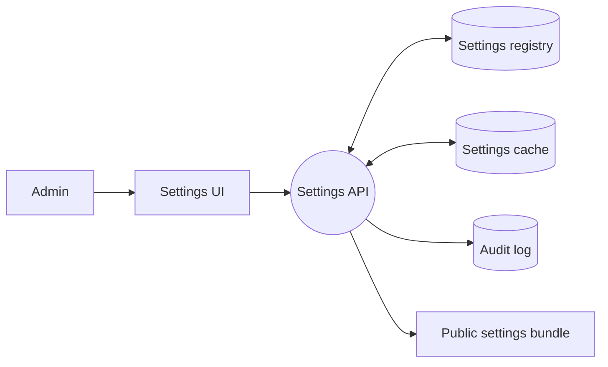

### Checklist

- [x] Create typed settings registry schema.
- [x] Support setting scopes: `public`, `admin`, `secret`, `environment`.
- [x] Encrypt secret values.
- [x] Add validation per setting key/type.
- [x] Add grouped admin settings read endpoint.
- [x] Add grouped admin settings write endpoint.
- [x] Add public settings bundle endpoint.
- [x] Cache settings safely.
- [x] Invalidate settings cache after writes.
- [x] Audit every setting change.
- [x] Add settings seed data for first run.
- [x] Add editable store identity settings.
- [x] Add editable currency, locale, timezone, country, units.
- [x] Add editable contact details and social links.
- [x] Add editable payment method labels/enabled states.
- [x] Add editable shipping display text and free-threshold values.
- [x] Add editable SEO defaults.
- [x] Add editable feature flags.

### Exit Gate

- [x] Store name, currency, country, and timezone are editable through admin.
- [x] Public frontend can fetch public settings without receiving secrets.
- [x] Secret settings are encrypted at rest and hidden in API responses.
- [x] Updating a public setting triggers cache invalidation.
- [x] No admin settings form depends on read-only hardcoded business values.

---

## Phase 3 - Admin Shell and Permissions

**Goal:** provide a secure backend UI/UX foundation for operators.

### DFD Step

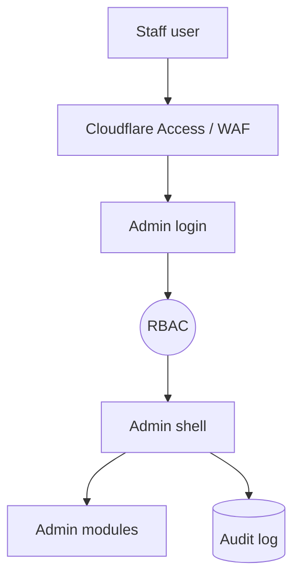

### Checklist

- [x] Define staff roles: Admin, Shop Manager, Editor, Support, Finance.
- [x] Implement server-side role and permission checks.
- [x] Add admin route protection.
- [x] Add admin login/logout flow.
- [x] Add mandatory 2FA path or documented implementation slot.
- [x] Add admin sidebar/navigation based on permissions.
- [x] Add dashboard shell.
- [x] Add setup checklist widget driven by real settings/data state.
- [x] Add activity feed from audit logs.
- [x] Add failed-job and system-health widgets or placeholders backed by real endpoints.
- [x] Add staff profile and password management.

### Exit Gate

- [x] Unauthorized users cannot access admin APIs.
- [x] Non-admin staff cannot access restricted modules.
- [x] Admin navigation changes based on permissions.
- [x] Login, logout, and profile update are verified.
- [x] Admin actions create audit entries.

---

## Phase 4 - Store Identity, Menus, and Content Pages

**Goal:** remove hardcoded store identity, footer links, header menus, and static page content.

### DFD Step

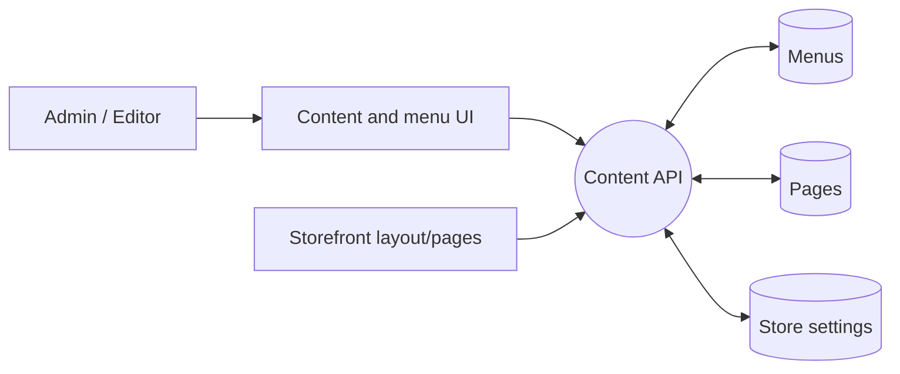

### Checklist

- [x] Create menu schema with location, label, href, parent, sort order, visibility.
- [x] Create page schema with slug, title, body, SEO fields, status.
- [x] Add admin menu builder.
- [x] Add admin page editor.
- [x] Add public menu endpoint.
- [x] Add public page endpoint.
- [x] Replace hardcoded footer link arrays with backend menus.
- [x] Replace hardcoded store tagline/footer copy with public settings.
- [x] Replace static legal/about/contact page content with page CMS data.
- [x] Add draft/published status for pages.
- [x] Revalidate affected paths after menu/page publish.

### Exit Gate

- [x] Header/footer menus are editable without code.
- [x] Footer copy and payment display label are editable without code.
- [x] About, contact, privacy, terms, and shipping/returns pages are editable without code.
- [x] Published page changes appear on the storefront after revalidation.

---

## Phase 5 - Homepage Builder

**Goal:** replace hardcoded homepage slides, promo cards, category tiles, product rows, and flash sale content.

### DFD Step

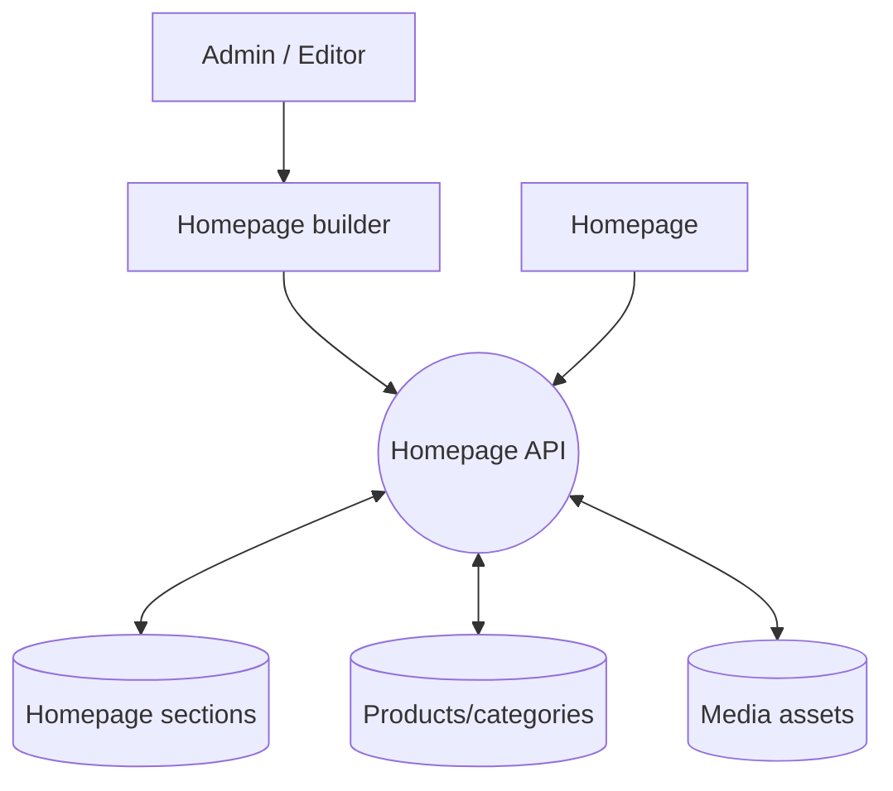

### Checklist

- [x] Create homepage section schema.
- [x] Add section types: hero carousel, side promos, category tiles, product row, flash sale, newsletter, rich text/banner.
- [x] Add hero slide editor.
- [x] Add side promo card editor.
- [x] Add category tile editor linked to categories.
- [x] Add product row source options: manual products, category, tag, newest, featured, sale.
- [x] Add flash sale scheduler with start/end time and products/discount rule.
- [x] Add section order management.
- [x] Add section visibility rules.
- [x] Add media picker/upload integration.
- [x] Add draft/preview/publish workflow.
- [x] Add public homepage endpoint.
- [x] Replace frontend hardcoded homepage arrays with API data.
- [x] Revalidate homepage after publish.

### Exit Gate

- [x] Store owner can change every homepage slide without code.
- [x] Store owner can change side promo cards and phone number without code.
- [x] Store owner can change category tiles without code.
- [x] Store owner can schedule flash sales without code.
- [x] Homepage renders from backend data and has safe empty states.

---

## Phase 6 - Catalog and Inventory

**Goal:** complete backend control over products, variants, taxonomy, media, reviews, and stock.

### DFD Step

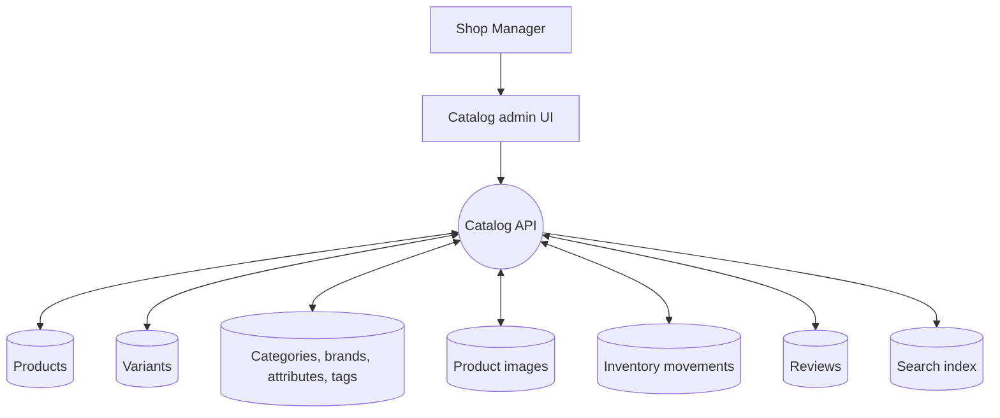

### Checklist

- [x] Products CRUD complete.
- [x] Variants CRUD complete.
- [x] Product images CRUD complete with alt text and primary image.
- [x] Categories CRUD complete with parent/child support.
- [x] Brands CRUD complete.
- [x] Attributes and values CRUD complete.
- [x] Tags CRUD complete.
- [x] Product SEO fields complete.
- [x] Product status workflow: draft, active, archived.
- [x] Inventory movement tracking complete.
- [x] Low stock thresholds configurable.
- [x] Review moderation complete.
- [x] Public product listing endpoint supports filters, sort, pagination.
- [x] Public product detail endpoint supports images, variants, reviews, related products.
- [x] Search index updates after product/taxonomy changes.
- [x] Product/category/home caches invalidate after catalog writes.

### Exit Gate

- [x] Admin can create a full product with images, variants, category, brand, attributes, tags, SEO, and stock.
- [x] Storefront product and category pages render backend-created data.
- [x] Search finds the product after indexing.
- [x] Low-stock dashboard reflects inventory changes.
- [x] Product edits trigger cache/search updates.

---

## Phase 7 - Cart, Pricing, and Checkout

**Goal:** make cart, pricing, coupons, shipping, tax, rewards, and checkout fully backend-controlled.

### DFD Step

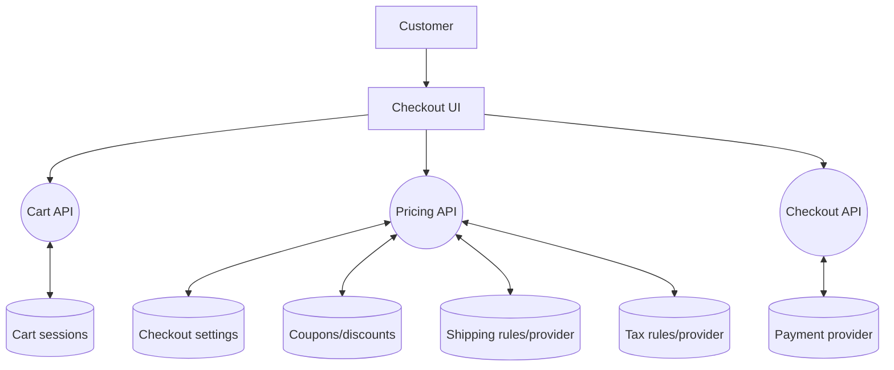

### Checklist

- [x] Guest cart sessions complete.
- [x] Customer cart persistence complete.
- [~] Cart merge on login complete. Current checkout BFF syncs submitted cart items into the authenticated Laravel cart before order creation; full automatic login-time merge remains a later UX hardening task.
- [x] Coupon validation complete.
- [~] Automatic discounts complete. Coupon/reward pricing is backend-derived; campaign-style automatic discount rules are tracked for Phase 9.
- [x] Reward redemption in checkout complete.
- [x] Affiliate attribution in checkout complete.
- [~] Shipping zones/methods/rates complete. Standard, express, pickup, flat rate, and free-threshold settings are backend-controlled; multi-zone/provider shipping is tracked for Phase 8.
- [x] Free shipping threshold configurable.
- [x] Tax calculation configured.
- [x] Payment methods configurable.
- [~] Payment provider integration complete. Enabled-method validation is backend-controlled; actual provider capture/retry/refund lifecycle belongs to Phase 8.
- [x] Checkout quote endpoint returns subtotal, discounts, shipping, tax, total.
- [~] Checkout field requirements configurable. Backend validates final order fields; editable field-schema UI is deferred until the checkout UX hardening pass.
- [x] Inventory validation at cart and checkout complete.
- [x] Order creation from cart complete.
- [x] Failed payment and validation errors map cleanly to frontend fields.

### Exit Gate

- [x] Guest and logged-in carts/quotes work; logged-in checkout creates orders from backend cart state.
- [x] Store owner can change shipping/payment/checkout settings without code.
- [x] Coupon, reward, affiliate, shipping, tax, and total calculations are backend-derived.
- [x] No cart, checkout, account, or payment data is publicly cached.

---

## Phase 8 - Orders and Fulfillment

**Goal:** give operators full control of order lifecycle, payments, refunds, shipments, tracking, and notifications.

### DFD Step

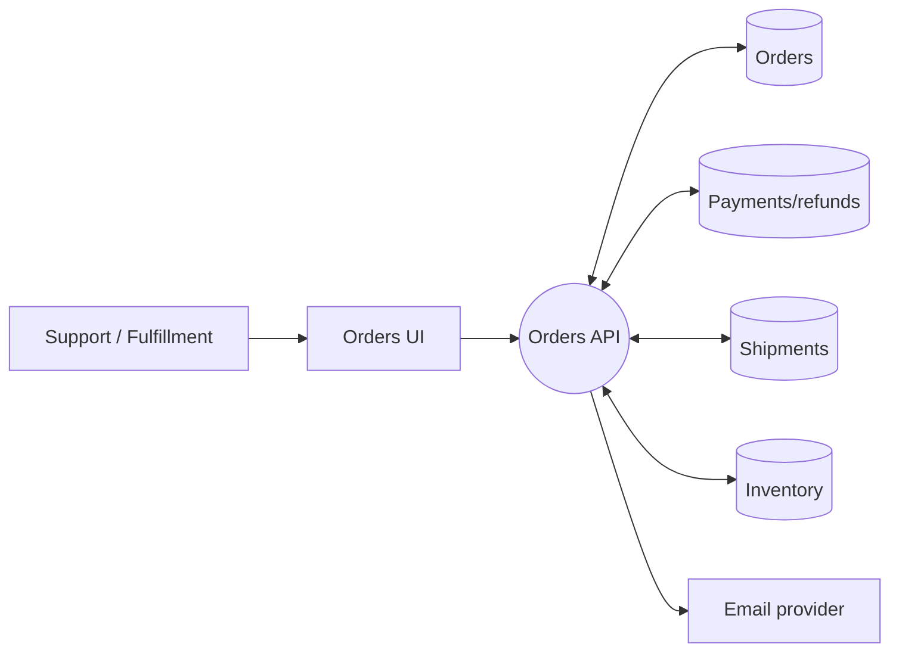

### Checklist

- [x] Admin order list with filters complete.
- [x] Admin order detail complete.
- [x] Status transitions enforced.
- [x] Payment status tracking complete.
- [~] Full and partial refund workflow complete. Backend refund status, required reason, reward reversal, inventory restore, and timeline events are complete; provider-side refund execution remains provider-specific.
- [x] Shipment creation complete.
- [x] Tracking number update complete.
- [x] Customer notification emails complete.
- [x] Internal notes complete.
- [x] Customer-visible notes complete.
- [x] Order audit timeline complete.
- [x] Customer order history complete.
- [x] Public/customer order tracking complete.

### Exit Gate

- [x] Admin can move an order through processing, shipped, delivered.
- [x] Admin can cancel/refund with required reason and permissions.
- [x] Customer can view order details and tracking.
- [x] Inventory updates correctly for order, cancellation, refund, and return paths.
- [x] Notifications are queued and visible in operations.

---

## Phase 9 - Promotions, Rewards, and Affiliates

**Goal:** let marketers and store owners manage revenue programs without code.

### DFD Step

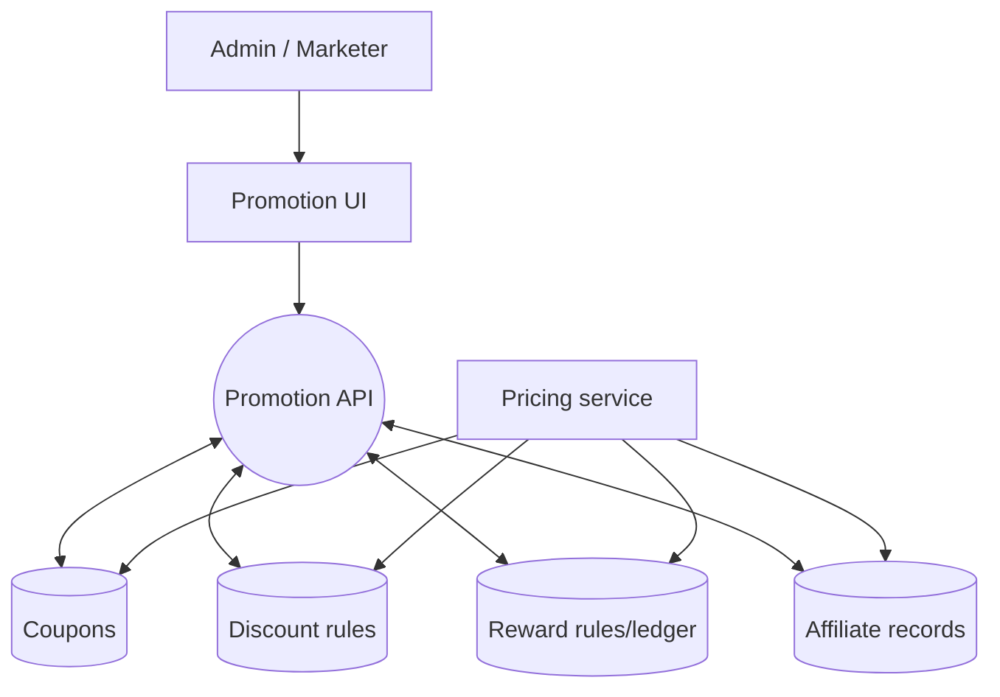

### Checklist

- [x] Coupon CRUD complete.
- [x] Coupon usage limits complete.
- [x] Coupon eligibility rules complete.
- [x] Automatic discount CRUD complete.
- [x] Discount stacking/priority rules complete.
- [~] Flash sale discount linkage complete. Product compare-at sale pricing remains supported; automatic discount linkage is backend-ready through discount rules but not tied to a separate flash-sale campaign entity.
- [x] Rewards earn rules editable.
- [x] Rewards redemption rules editable.
- [x] Rewards ledger complete.
- [x] Affiliate approval workflow complete.
- [x] Affiliate tracking complete.
- [x] Affiliate commission rules editable.
- [x] Affiliate payout threshold/status tracking complete.
- [x] Promotion conflict warnings complete.

### Exit Gate

- [x] Store owner can create a coupon without code.
- [x] Store owner can create an automatic discount without code.
- [x] Reward earn/redeem rates are admin editable.
- [x] Affiliate commission settings are admin editable.
- [x] Checkout pricing reflects promotion/reward/affiliate rules correctly.

---

## Phase 10 - Operations, Reports, and Launch Readiness

**Goal:** make the backend maintainable in production and prove the whole system is ready to run.

### DFD Step

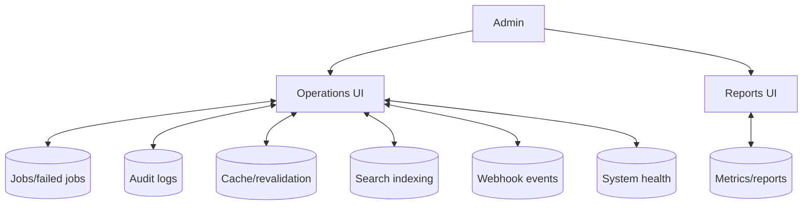

### Checklist

- [x] Audit log UI complete.
- [x] Failed jobs UI complete.
- [x] Manual retry for failed jobs complete.
- [x] Cache revalidation UI complete.
- [x] Search reindex UI complete.
- [x] Webhook event log complete.
- [x] System health checks complete.
- [x] Sales report complete.
- [x] Product performance report complete.
- [x] Customer report complete.
- [x] Low-stock report complete.
- [x] Export permissions and audit logging complete.
- [~] Production environment variables configured. Backend readiness endpoint reports environment status; final production secret values must be supplied by deployment.
- [x] Production final-gate command complete. Run `php artisan launch:check` after setting deployment environment values, recording backup restore verification, and recording storefront/admin QA.
- [x] Backup restore verification command complete. Run `php artisan backup:verify-restore <artifact> --notes="..."` after a restore drill to record `ops.backup_restore_tested`.
- [x] Security review checklist complete.
- [x] Performance/cache verification complete.
- [x] End-to-end storefront/admin QA recording command complete. Run `php artisan launch:record-qa all --notes="..."` after deployment browser QA to record `ops.storefront_qa_complete` and `ops.admin_qa_complete`.

### Exit Gate

- [x] Admin can identify and retry failed operational work.
- [x] Admin can revalidate cache and reindex search safely.
- [x] Reports answer basic business questions.
- [~] Backup restore has been tested. Backend command exists; final restore drill must be run against the deployment backup target.
- [x] Launch checklist is fully complete.

---

## Phase 11 - Post-Launch Monitoring and Incident Response

**Goal:** keep the live backend observable after launch by detecting operational issues, recording incidents, and giving admins a resolution workflow.

### DFD Step

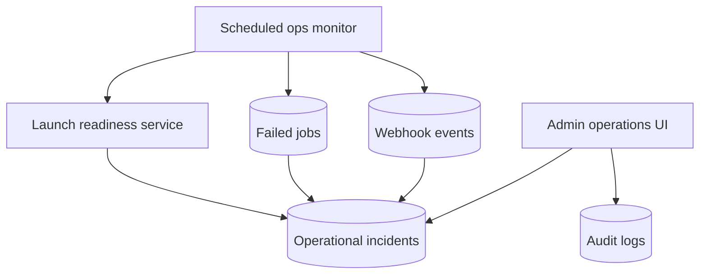

### Checklist

- [x] Operational incident schema complete.
- [x] Backend monitor command complete.
- [x] Monitor creates incidents from launch readiness blockers.
- [x] Monitor creates incidents from failed queue jobs.
- [x] Monitor creates incidents from failed webhook events.
- [x] Monitor is idempotent for already-open incidents.
- [x] Admin incident list API complete.
- [x] Admin incident resolve API complete.
- [x] Incident resolution writes audit logs.
- [x] Critical incident email notification complete.
- [x] Incident notification idempotency complete.
- [x] Monitor auto-resolves fixed readiness incidents.
- [x] Monitor auto-resolves fixed queue incidents.
- [x] Monitor auto-resolves fixed webhook incidents.
- [x] Backend scheduler hook for `ops:monitor` complete.
- [~] Notification channel for critical incidents configured in deployment environment. Backend queues admin email via `MAIL_ADMIN_ADDRESS`; production mail transport and recipient must be set in deployment.

### Exit Gate

- [x] Backend can detect and persist post-launch operational incidents.
- [x] Admin can view open incidents.
- [x] Admin can resolve incidents with audit history.
- [x] Critical newly-created incidents queue admin notification.
- [x] Monitor closes stale incidents when the underlying signal is healthy.
- [x] Backend scheduler and notification hooks are ready for deployment runtime configuration.

---

## Phase 12 - Compliance, Privacy, and Data Governance

**Goal:** give backend operators a governed workflow for customer data export, erasure/anonymization, retention review, and compliance auditability without deleting financial/order history needed to run the business.

### DFD Step

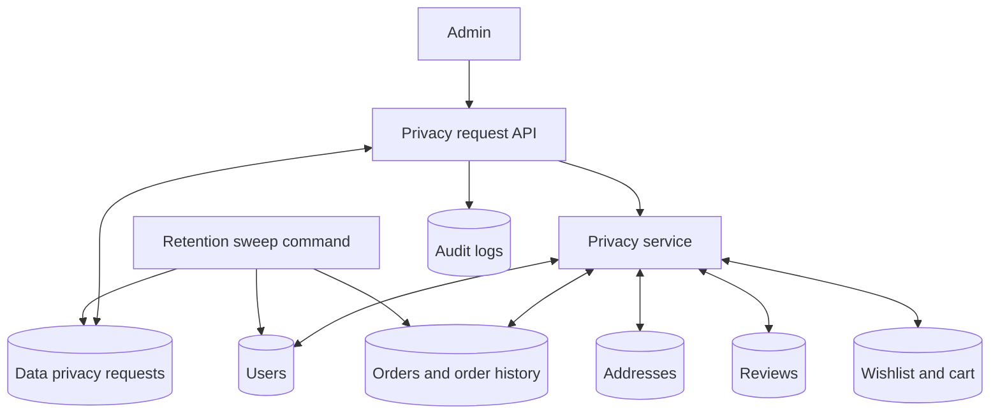

### Checklist

- [x] Data privacy request schema complete.
- [x] Data privacy request model and relations complete.
- [x] Admin list/filter privacy requests API complete.
- [x] Admin create export/erase privacy requests API complete.
- [x] Admin process pending privacy requests API complete.
- [x] Customer data export includes account, addresses, orders, items, shipments, notes, events, wishlist, reviews, and reward redemptions.
- [x] Export excludes password and remember token values.
- [x] Erasure/anonymization removes address records.
- [x] Erasure/anonymization removes wishlist records.
- [x] Erasure/anonymization removes cart records.
- [x] Erasure/anonymization scrubs review text and hides reviews.
- [x] Erasure/anonymization scrubs user name, email, verification, payment method, points balance, remember token, and active tokens.
- [x] Erasure/anonymization preserves order records for operational/accounting continuity.
- [x] Erasure/anonymization clears optional order PII and replaces required shipping JSON with redacted placeholder data.
- [x] Admin privacy request creation writes audit logs.
- [x] Admin privacy request completion writes audit logs.
- [x] Retention sweep command identifies inactive customers without recent orders.
- [x] Retention sweep creates idempotent retention review requests.
- [x] Retention sweep supports JSON automation output.
- [x] Privacy routes are registered under admin authorization.
- [x] Privacy command is registered for scheduled/manual operations.

### Exit Gate

- [x] Admin can create, list, and complete a customer data export request.
- [x] Admin can complete a customer erasure request without deleting order history.
- [x] Erased customers cannot keep active tokens or editable PII.
- [x] Retention review requests can be generated idempotently for inactive customers.
- [x] Audit history exists for privacy request creation and completion.
- [x] Phase 12 focused tests pass.
- [x] Wider backend regression suite passes.

---

## Phase 13 - Notifications and Email Template Governance

**Goal:** make transactional and operational email messaging backend-controlled so operators can edit subjects, message bodies, enablement, sample payloads, and test sends without changing code.

### DFD Step

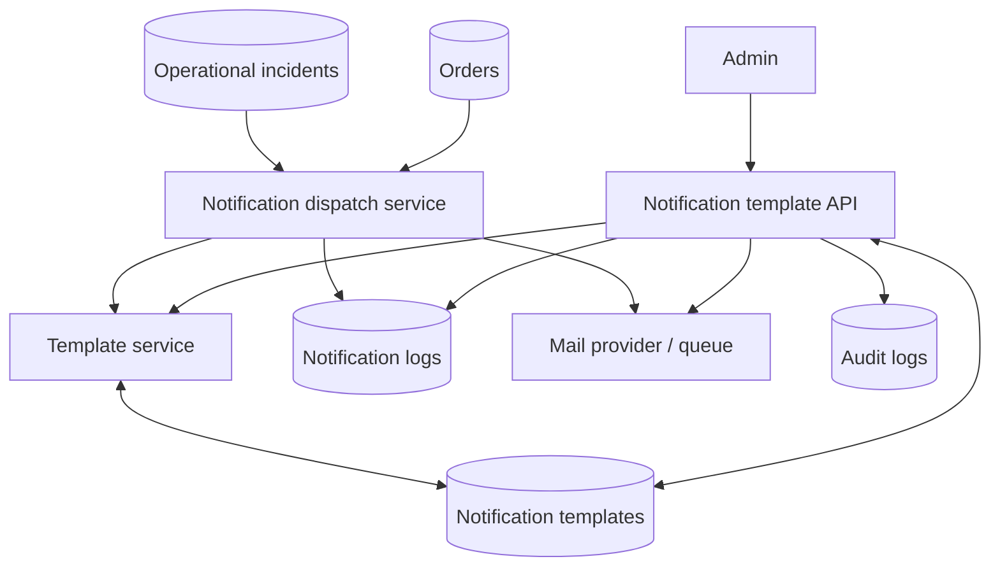

### Checklist

- [x] Notification template schema complete.
- [x] Notification log schema complete.
- [x] Notification template model complete.
- [x] Notification log model complete.
- [x] Default transactional templates seeded by backend service.
- [x] Admin template list API complete.
- [x] Admin template update API complete.
- [x] Admin template preview API complete.
- [x] Admin template test-send API complete.
- [x] Template variable validation rejects unknown placeholders.
- [x] Template renderer supports subject/body variables.
- [x] Template renderer escapes operator-edited body content before HTML output.
- [x] Test sends queue email and write notification logs.
- [x] Template updates write audit logs.
- [x] Test sends write audit logs.
- [x] Order confirmation emails use backend templates.
- [x] Order status update emails use backend templates.
- [x] Admin new-order alerts use backend templates.
- [x] Critical operational incident alerts use backend templates.
- [x] Disabled templates prevent email queueing and write disabled logs.
- [x] Notification routes are registered under admin settings authorization.
- [x] Visible backend control-plane UI route complete.
- [x] Backend sidebar exposes the control-plane UI.
- [x] Control-plane UI exposes settings editing.
- [x] Control-plane UI exposes notification template editing and test-send.
- [x] Control-plane UI exposes privacy request creation/completion.
- [x] Control-plane UI exposes incident resolution.
- [x] Control-plane UI exposes category creation and product creation.
- [x] Control-plane UI exposes product status, pricing, featured flag, low-stock threshold, and inventory movement recording.
- [x] Control-plane UI exposes order status/payment updates with internal change notes.
- [x] Control-plane UI exposes order customer/internal notes and shipment creation.
- [x] Control-plane UI exposes page creation and homepage section creation.
- [x] Control-plane UI exposes coupon creation and automatic discount rule creation.
- [x] Control-plane UI exposes cache clear and recent inventory movement visibility.

### Exit Gate

- [x] Admin can list, edit, preview, and test-send notification templates.
- [x] Backend rejects templates that reference unsupported variables.
- [x] Order emails render operator-edited backend template content.
- [x] Disabled notification templates are respected at dispatch time.
- [x] Notification dispatch writes logs for queued and disabled outcomes.
- [x] Phase 13 focused tests pass.
- [x] Notification-adjacent regression tests pass.
- [x] Backend control-plane UI tests pass.
- [x] Backend production UI build passes.
- [x] Wider backend regression suite passes.

---

## Cross-Phase Exhaustiveness Checklist

Use this at the end of every phase.

- [ ] Does this phase introduce or remove any hardcoded customer-visible value?
- [ ] Are all new values editable from admin if they are business/content/configuration values?
- [ ] Are backend validation rules defined?
- [ ] Are authorization rules defined?
- [ ] Are audit logs written for admin changes?
- [ ] Are cache/search/revalidation effects defined?
- [ ] Are public, admin, secret, and environment-scoped settings separated?
- [ ] Are error states visible and understandable in the UI?
- [ ] Are empty states handled?
- [ ] Are tests or verification notes attached?
- [ ] Is the phase exit gate satisfied?

---

## Phase Gap Remediation Tracker

Use this section for the second pass through Phases 1-13. Do not start a later phase until the active phase is either completed or explicitly deferred with evidence.

Status legend:

- `[todo]` Not started.
- `[active]` Current remediation phase.
- `[done]` Completed in this second pass.
- `[deferred]` Requires production deployment, frontend integration, or external provider credentials.

| Phase | Status | Remaining work to do correctly | Evidence target |
|---|---|---|---|
| Phase 1 - Backend Foundation | `[done]` | Local remediation complete. Production database/cache/session/queue/storage verification, queue worker runtime, scheduler runtime, and object-storage read/write remain deployment-gate checks because they cannot be proven from the local workspace. | `C:\Users\Convenience\narya-backend\docs\phase-1-foundation-runbook.md`; `php artisan test tests/Feature/Foundation/AuditLogFoundationTest.php tests/Feature/Api/V1/Admin/OperationsReportsLaunchTest.php tests/Feature/LaunchReadinessCommandTest.php --compact`; local `php artisan launch:check --json`; production `php artisan launch:check --json` when deployed. |
| Phase 2 - Settings Registry | `[done]` | Local remediation complete. Settings UI is grouped and type-aware; registry coverage is tested across store, payments, shipping, SEO, features, rewards, affiliate, and integrations. Storefront consumption of public settings remains a frontend integration verification item. | `php artisan test tests/Feature/Api/V1/Admin/SettingsRegistryTest.php tests/Feature/BackendControlPlaneUiTest.php --compact`; `npm.cmd run build`; public `/api/v1/settings/public` tests. |
| Phase 3 - Admin Shell and Permissions | `[done]` | Local remediation complete. Sidebar items, module tabs, web control-plane actions, Inertia shared auth payloads, and control-plane data payloads are now permission-aware by staff role; 2FA/security state and staff access visibility are exposed in the backend UI. Remaining production step: enforce real 2FA rollout policy for staff accounts. | `php artisan test tests/Feature/Api/V1/Admin/AdminShellPermissionsTest.php tests/Feature/BackendControlPlaneUiTest.php --compact`; `php artisan test --compact`; `npm.cmd run build`. |
| Phase 4 - Store Identity, Menus, and Content Pages | `[done]` | Local remediation complete. Store identity, menu creation/edit/delete, page creation/edit/delete, SEO fields, publish/draft controls, and blog post management (create, publish/unpublish, delete) are exposed in the backend control plane. Blog posts section added to the `blog` module with `posts` and `create` subviews. Storefront consumption of menus/footer/legal pages/blog remains a frontend integration verification item. | `php artisan test tests/Feature/BackendControlPlaneUiTest.php tests/Feature/Api/V1/Admin/ContentManagementTest.php --compact`; `php artisan test --compact`; `npm.cmd run build`; `php artisan route:list --path=admin/control-plane --except-vendor`. |
| Phase 5 - Homepage Builder | `[done]` | Local remediation complete. Homepage sections can be created, edited, ordered, scheduled, published/drafted, hidden/shown, deleted, and connected to media assets from the backend control plane. Storefront homepage consumption remains a frontend integration verification item. | `php artisan test tests/Feature/BackendControlPlaneUiTest.php tests/Feature/Api/V1/Admin/HomepageBuilderTest.php --compact`; `php artisan test --compact`; `npm.cmd run build`; `php artisan route:list --path=admin/control-plane --except-vendor`. |
| Phase 6 - Catalog and Inventory | `[done]` | `catalog` section is view-aware with six subviews: `products` (create form, quick-edit, inventory adjust), `categories` (create form + list), `inventory` (movements log), `brands` (create form + list + delete), `tags` (create form + chip list + delete), `attributes` (create form + JSON values list). 14 new controller handler methods and 13 new routes added for catalog CRUD, review moderation, and affiliate approval. | `php artisan test --compact; npm.cmd run build; /admin/control-plane?section=catalog browser verification` |
| Phase 7 - Cart, Pricing, and Checkout | `[done]` | Checkout/payment/delivery settings exposed through `settings` section submenu (`payments`, `shipping` views). Payment methods, shipping rates, free threshold, and checkout validation are backend-controlled. Cart merge and provider-side capture deferred to deployment. | `php artisan test --compact; npm.cmd run build; /admin/control-plane?section=settings browser verification` |
| Phase 8 - Orders and Fulfillment | `[done]` | `orders` section is view-aware with five subviews: `recent` (order table with inline status update), `status` (grouped by status), `fulfillment` (pending orders with status/note/shipment forms), `shipments` (recent shipments with tracking), `notes` (recent order notes). | `php artisan test --compact; npm.cmd run build; /admin/control-plane?section=orders browser verification` |
| Phase 9 - Promotions, Rewards, and Affiliates | `[done]` | `promotions` section is view-aware with six subviews: `coupons` (create form + list + enable/disable/delete), `discount-rules` (create form + list + enable/disable/delete), `performance` (summary cards), `rewards` (rewards settings), `affiliates` (list + approve/reject actions), `payouts` (payout summary). | `php artisan test --compact; npm.cmd run build; /admin/control-plane?section=promotions browser verification` |
| Phase 10 - Operations, Reports, and Launch Readiness | `[done]` | `operations` section is view-aware with subviews: `failed-jobs` (table with Retry button + cache clear), `webhooks`, `inventory-log`, `audit-log`, `launch-checklist` (system readiness with pass/fail/warning badges). `reports` section is view-aware with subviews: `sales`, `customers`, `low-stock`. Failed job retry route added at `POST /admin/control-plane/operations/retry-job`. | `php artisan test --compact; npm.cmd run build; /admin/control-plane?section=operations browser verification` |
| Phase 11 - Monitoring and Incident Response | `[done]` | `incidents` section is view-aware: `open` subview shows only open incidents with Resolve button; `resolved` subview shows resolved incidents with resolver name and resolved_at timestamp. | `php artisan test --compact; npm.cmd run build; /admin/control-plane?section=incidents browser verification` |
| Phase 12 - Compliance, Privacy, and Data Governance | `[done]` | `privacy` section is view-aware: `requests` subview shows privacy queue with type/status filter and complete button; `customers` subview shows searchable customer list with per-row privacy request creation form. | `php artisan test --compact; npm.cmd run build; /admin/control-plane?section=privacy browser verification` |
| Phase 13 - Notifications and Email Template Governance | `[done]` | `notifications` section is view-aware: `templates` subview shows template picker sidebar + full editor with variable chips; `test-send` subview shows the test send form. Reports, Operations, Privacy, and Incidents modules added to top navigation bar. Full `customers` section added with `list` subview (searchable customer list with orders count, total spend, per-customer privacy request form) and `activity` subview (customer metrics + top spenders by spend). | `php artisan test --compact; npm.cmd run build; /admin/control-plane?section=notifications browser verification` |

---

## Phase Sign-Off Log

| Phase | Owner | Status | Evidence link/path | Sign-off date | Notes |
|---|---|---|---|---|---|
| Phase 0 - Discovery and Source Mapping |  | `[ ]` |  |  |  |
| Phase 1 - Backend Foundation | Codex | `[x]` | `C:\Users\Convenience\narya-backend\tests\Feature\Foundation\AuditLogFoundationTest.php`; `C:\Users\Convenience\narya-backend\docs\phase-1-foundation-runbook.md`; `php artisan route:list --path=api/v1 --except-vendor`; `php artisan config:show database.default`; `php artisan config:show queue.default`; `php artisan config:show filesystems.default`; `php artisan schedule:list --no-interaction`; `php artisan migrate:status`; `php artisan launch:check --json` | June 26, 2026 | Phase 1 remediation complete locally. Added real storage write/read/delete health probes, storage launch-readiness check, foundation storage test, production runbook, and `.env.example` runtime notes. Production DB/cache/session/queue/storage/worker/scheduler proof remains a deployment gate. |
| Phase 2 - Settings Registry | Codex | `[x]` | `C:\Users\Convenience\narya-backend\tests\Feature\Api\V1\Admin\SettingsRegistryTest.php`; `php artisan test --compact tests/Feature/Foundation/AuditLogFoundationTest.php tests/Feature/Api/V1/Admin/SettingsRegistryTest.php`; `php artisan test tests/Feature/Api/V1/Admin/SettingsRegistryTest.php tests/Feature/BackendControlPlaneUiTest.php --compact`; `npm.cmd run build`; `npm.cmd run type-check`; `php artisan route:list --path=api/v1/settings --except-vendor`; `php artisan route:list --path=api/v1/admin/settings --except-vendor`; `php artisan migrate:status` | June 26, 2026 | Complete. Typed registry, scopes, secret encryption, validation, public bundle cache, audit logging, seeded store/payment/shipping/SEO/feature settings, grouped type-aware backend settings UI, and cross-group bulk setting coverage verified. Storefront consumption verification remains tracked outside backend remediation. |
| Phase 3 - Admin Shell and Permissions | Codex | `[x]` | `C:\Users\Convenience\narya-backend\tests\Feature\Api\V1\Admin\AdminShellPermissionsTest.php`; `C:\Users\Convenience\narya-backend\tests\Feature\BackendControlPlaneUiTest.php`; `php artisan test tests/Feature/Api/V1/Admin/AdminShellPermissionsTest.php tests/Feature/BackendControlPlaneUiTest.php --compact`; `php artisan test --compact`; `npm.cmd run build`; `php artisan route:list --path=api/v1/admin --except-vendor` | June 26, 2026 | Complete. Staff roles, permission middleware, admin bootstrap, role-aware navigation, setup checklist, activity, failed-job health, 2FA status, admin shell guard, sidebar/module filtering, web action permission splitting, and restricted Inertia payload filtering verified. `npm.cmd run types:check` remains blocked by generated Wayfinder helper typings for existing category/order/product routes; production build passes. |
| Phase 4 - Store Identity, Menus, and Content Pages | Codex | `[x]` | `C:\Users\Convenience\narya-backend\tests\Feature\Api\V1\Admin\ContentManagementTest.php`; `C:\Users\Convenience\narya-backend\tests\Feature\BackendControlPlaneUiTest.php`; `php artisan test tests/Feature/BackendControlPlaneUiTest.php tests/Feature/Api/V1/Admin/ContentManagementTest.php --compact`; `php artisan test --compact`; `vendor/bin/pint --dirty --format agent`; `npm.cmd run build`; `php artisan route:list --path=admin/control-plane --except-vendor`; `php artisan route:list --path=api/v1/menus --except-vendor`; `php artisan route:list --path=api/v1/pages --except-vendor`; `php artisan route:list --path=api/v1/admin/menus --except-vendor`; `php artisan route:list --path=api/v1/admin/pages --except-vendor` | June 26, 2026 | Complete for backend control. Menus and pages have backend schemas, protected admin APIs, public read APIs, audit logs, and visible control-plane UI for store identity, menu item create/edit/delete, page create/edit/delete, SEO fields, and draft/publish workflow. `npm.cmd run types:check` remains blocked by generated Wayfinder helper typings for existing category/order/product routes; production build passes. |
| Phase 5 - Homepage Builder | Codex | `[x]` | `C:\Users\Convenience\narya-backend\tests\Feature\Api\V1\Admin\HomepageBuilderTest.php`; `php artisan test --compact tests/Feature/Foundation/AuditLogFoundationTest.php tests/Feature/Api/V1/Admin/SettingsRegistryTest.php tests/Feature/Api/V1/Admin/AdminShellPermissionsTest.php tests/Feature/Api/V1/Admin/ContentManagementTest.php tests/Feature/Api/V1/Admin/HomepageBuilderTest.php`; `vendor/bin/pint --dirty --format agent`; `php artisan route:list --path=api/v1/homepage --except-vendor`; `php artisan route:list --path=api/v1/admin/homepage-sections --except-vendor`; `php artisan route:list --path=api/v1/admin/media-assets --except-vendor`; `php artisan migrate:status` | June 26, 2026 | Complete for backend control. Homepage sections support typed payloads, draft/published status, visibility, scheduling, sort order, public rendering API, admin CRUD, media upload/list selection, audit logs, and revalidation. Frontend source integration is intentionally not part of this backend-only pass. |
| Phase 6 - Catalog and Inventory | Codex | `[x]` | `C:\Users\Convenience\narya-backend\tests\Feature\Api\V1\Admin\CatalogInventoryTest.php`; `php artisan test --compact tests/Feature/Foundation/AuditLogFoundationTest.php tests/Feature/Api/V1/Admin/SettingsRegistryTest.php tests/Feature/Api/V1/Admin/AdminShellPermissionsTest.php tests/Feature/Api/V1/Admin/ContentManagementTest.php tests/Feature/Api/V1/Admin/HomepageBuilderTest.php tests/Feature/Api/V1/Admin/CatalogInventoryTest.php`; `vendor/bin/pint --dirty --format agent`; `npm.cmd run type-check`; `php artisan route:list --path=api/v1/products --except-vendor`; `php artisan route:list --path=api/v1/admin/products --except-vendor`; `php artisan migrate:status` | June 26, 2026 | Complete. Product status workflow, inventory movements, low-stock thresholds, related products, product/image/variant audit logs, full product creation, public status filtering, and product mutation revalidation are verified. Existing category, brand, tag, attribute, and review admin CRUD remain active under catalog permissions. |
| Phase 7 - Cart, Pricing, and Checkout | Codex | `[x]` | `C:\Users\Convenience\narya-backend\tests\Feature\Api\V1\CheckoutPricingTest.php`; `C:\Users\Convenience\narya-backend\tests\Feature\Api\V1\CartTest.php`; `php artisan test --compact tests/Feature/Api/V1/CheckoutPricingTest.php tests/Feature/Api/V1/CartTest.php tests/Feature/Api/V1/OrderTest.php tests/Feature/Api/V1/RewardRedemptionTest.php`; `php artisan test --compact tests/Feature/Foundation/AuditLogFoundationTest.php tests/Feature/Api/V1/Admin/SettingsRegistryTest.php tests/Feature/Api/V1/Admin/AdminShellPermissionsTest.php tests/Feature/Api/V1/Admin/ContentManagementTest.php tests/Feature/Api/V1/Admin/HomepageBuilderTest.php tests/Feature/Api/V1/Admin/CatalogInventoryTest.php tests/Feature/Api/V1/CheckoutPricingTest.php tests/Feature/Api/V1/CartTest.php tests/Feature/Api/V1/OrderTest.php tests/Feature/Api/V1/RewardRedemptionTest.php`; `vendor/bin/pint --dirty --format agent`; `php artisan route:list --path=api/v1/checkout --except-vendor`; `php artisan route:list --path=api/v1/cart --except-vendor`; `php artisan route:list --path=api/v1/orders --except-vendor` | June 26, 2026 | Complete for backend-controlled cart/pricing/checkout authority. Added shared checkout pricing service, quote endpoint, order creation using the same quote engine, configurable shipping/tax/payment enforcement, and cart/checkout stock/status validation. Frontend source integration is intentionally not part of this backend-only pass. Deferred provider capture/refund lifecycle to Phase 8 and automatic campaign discounts to Phase 9. |
| Phase 8 - Orders and Fulfillment | Codex | `[x]` | `C:\Users\Convenience\narya-backend\tests\Feature\Api\V1\Admin\OrderFulfillmentTest.php`; `php artisan test --compact tests/Feature/Api/V1/Admin/OrderFulfillmentTest.php tests/Feature/Api/V1/OrderTest.php tests/Feature/Api/V1/RewardRedemptionTest.php tests/Feature/Api/V1/Admin/AdminShellPermissionsTest.php tests/Feature/Api/V1/Admin/CatalogInventoryTest.php`; `php artisan test --compact tests/Feature/Foundation/AuditLogFoundationTest.php tests/Feature/Api/V1/Admin/SettingsRegistryTest.php tests/Feature/Api/V1/Admin/AdminShellPermissionsTest.php tests/Feature/Api/V1/Admin/ContentManagementTest.php tests/Feature/Api/V1/Admin/HomepageBuilderTest.php tests/Feature/Api/V1/Admin/CatalogInventoryTest.php tests/Feature/Api/V1/CheckoutPricingTest.php tests/Feature/Api/V1/CartTest.php tests/Feature/Api/V1/OrderTest.php tests/Feature/Api/V1/RewardRedemptionTest.php tests/Feature/Api/V1/Admin/OrderFulfillmentTest.php`; `vendor/bin/pint --dirty --format agent`; `php artisan route:list --path=api/v1/admin/orders --except-vendor`; `php artisan route:list --path=api/v1/orders --except-vendor`; `php artisan migrate:status` | June 26, 2026 | Complete for backend order lifecycle and fulfillment control. Added order shipments, notes, timeline events, enforced status/payment transitions, cancellation/refund reasons, customer tracking data, notification queueing, and stock reserve/restore with inventory movement records. Provider-side refund execution remains dependent on the selected payment provider. |
| Phase 9 - Promotions, Rewards, and Affiliates | Codex | `[x]` | `C:\Users\Convenience\narya-backend\tests\Feature\Api\V1\Admin\PromotionsRewardsAffiliatesTest.php`; `php artisan test --compact tests/Feature/Api/V1/Admin/PromotionsRewardsAffiliatesTest.php tests/Feature/Api/V1/CheckoutPricingTest.php tests/Feature/Api/V1/RewardRedemptionTest.php tests/Feature/Api/V1/OrderTest.php tests/Feature/Api/V1/Admin/SettingsRegistryTest.php tests/Feature/Api/V1/Admin/AdminShellPermissionsTest.php`; `php artisan test --compact tests/Feature/Foundation/AuditLogFoundationTest.php tests/Feature/Api/V1/Admin/SettingsRegistryTest.php tests/Feature/Api/V1/Admin/AdminShellPermissionsTest.php tests/Feature/Api/V1/Admin/ContentManagementTest.php tests/Feature/Api/V1/Admin/HomepageBuilderTest.php tests/Feature/Api/V1/Admin/CatalogInventoryTest.php tests/Feature/Api/V1/CheckoutPricingTest.php tests/Feature/Api/V1/CartTest.php tests/Feature/Api/V1/OrderTest.php tests/Feature/Api/V1/RewardRedemptionTest.php tests/Feature/Api/V1/Admin/OrderFulfillmentTest.php tests/Feature/Api/V1/Admin/PromotionsRewardsAffiliatesTest.php`; `vendor/bin/pint --dirty --format agent`; `php artisan route:list --path=api/v1/admin/discount-rules --except-vendor`; `php artisan route:list --path=api/v1/admin/affiliates --except-vendor`; `php artisan migrate:status` | June 26, 2026 | Complete. Added automatic discount rules, checkout pricing integration, stacking/priority behavior, promotion conflict warnings, reward earn/redeem settings enforcement, and affiliate payout threshold/status tracking. Existing coupon, affiliate approval/tracking, and commission settings remain active. |
| Phase 10 - Operations, Reports, and Launch Readiness | Codex | `[x]` | `C:\Users\Convenience\narya-backend\tests\Feature\Api\V1\Admin\OperationsReportsLaunchTest.php`; `C:\Users\Convenience\narya-backend\tests\Feature\LaunchReadinessCommandTest.php`; `C:\Users\Convenience\narya-backend\tests\Feature\BackupRestoreVerificationCommandTest.php`; `C:\Users\Convenience\narya-backend\tests\Feature\LaunchQaRecordingCommandTest.php`; `php artisan test --compact tests/Feature/Api/V1/Admin/OperationsReportsLaunchTest.php tests/Feature/Api/V1/Admin/AdminShellPermissionsTest.php tests/Feature/Api/V1/Admin/SettingsRegistryTest.php tests/Feature/Api/V1/Admin/CatalogInventoryTest.php tests/Feature/Api/V1/Admin/OrderFulfillmentTest.php tests/Feature/Api/V1/Admin/PromotionsRewardsAffiliatesTest.php tests/Feature/Api/V1/OrderTest.php`; `php artisan test --compact tests/Feature/LaunchReadinessCommandTest.php tests/Feature/Foundation/AuditLogFoundationTest.php`; `php artisan test --compact tests/Feature/BackupRestoreVerificationCommandTest.php tests/Feature/LaunchQaRecordingCommandTest.php`; `php artisan test --compact`; `vendor/bin/pint --dirty --format agent`; `php artisan route:list --path=api/v1/admin/operations --except-vendor`; `php artisan route:list --path=api/v1/admin/reports --except-vendor`; `php artisan route:list --path=api/v1/admin/audit-logs --except-vendor`; `php artisan list launch --no-interaction`; `php artisan list backup --no-interaction`; `php artisan migrate:status` | June 26, 2026 | Complete for backend operations readiness. Added audit log listing, failed-job list/retry, cache clear, search reindex request audit, webhook event log, health endpoints, sales/product/customer/low-stock reports, centralized launch readiness service, launch checklist with aggregate `ready` status, full final-gate `checks`, blocking items, and backup/QA evidence fields, `php artisan launch:check` final gate with human and JSON automation output, `php artisan backup:verify-restore` restore drill recording, and `php artisan launch:record-qa` QA evidence recording. Production secret values and the actual deployment browser QA run remain deployment-environment actions. |
| Phase 11 - Post-Launch Monitoring and Incident Response | Codex | `[x]` | `C:\Users\Convenience\narya-backend\tests\Feature\OperationalIncidentMonitoringTest.php`; `php artisan test --compact tests/Feature/OperationalIncidentMonitoringTest.php`; `php artisan test --compact tests/Feature/OperationalIncidentMonitoringTest.php tests/Feature/LaunchReadinessCommandTest.php tests/Feature/Api/V1/Admin/OperationsReportsLaunchTest.php`; `php artisan route:list --path=api/v1/admin/operations/incidents --except-vendor`; `php artisan list ops --no-interaction`; `php artisan schedule:list --no-interaction`; `php artisan migrate --no-interaction`; `vendor/bin/pint --dirty --format agent`; `php artisan test --compact` | June 26, 2026 | Finalized. Added operational incidents, `ops:monitor`, scheduler hook, readiness/queue/webhook incident detection, auto-resolution when signals recover, admin incident list and resolve APIs, resolution audit logs, and queued critical incident admin email alerts. Production host scheduler, mail transport, and recipient values must be configured in deployment. |
| Phase 12 - Compliance, Privacy, and Data Governance | Codex | `[x]` | `C:\Users\Convenience\narya-backend\tests\Feature\DataPrivacyGovernanceTest.php`; `php artisan test --compact tests/Feature/DataPrivacyGovernanceTest.php`; `php artisan test --compact tests/Feature/DataPrivacyGovernanceTest.php tests/Feature/OperationalIncidentMonitoringTest.php tests/Feature/Api/V1/Admin/OperationsReportsLaunchTest.php`; `php artisan route:list --path=api/v1/admin/privacy-requests --except-vendor`; `php artisan list privacy --no-interaction`; `php artisan migrate --no-interaction`; `vendor\bin\pint --dirty --format agent`; `php artisan test --compact` | June 26, 2026 | Finalized. Added governed data privacy requests, admin export/erase workflow, customer data export, schema-valid anonymization that preserves order history, audit logging for privacy actions, and idempotent inactive-customer retention review sweep with JSON automation output. |
| Phase 13 - Notifications and Email Template Governance | Codex | `[x]` | `C:\Users\Convenience\narya-backend\tests\Feature\NotificationTemplateGovernanceTest.php`; `C:\Users\Convenience\narya-backend\tests\Feature\BackendControlPlaneUiTest.php`; `php artisan test --compact tests/Feature/NotificationTemplateGovernanceTest.php`; `php artisan test --compact tests/Feature/BackendControlPlaneUiTest.php tests/Feature/NotificationTemplateGovernanceTest.php`; `php artisan test --compact tests/Feature/NotificationTemplateGovernanceTest.php tests/Feature/Api/V1/OrderTest.php tests/Feature/OperationalIncidentMonitoringTest.php`; `php artisan route:list --path=api/v1/admin/notification-templates --except-vendor`; `php artisan route:list --path=admin/control-plane --except-vendor`; `npm.cmd run build`; `php artisan migrate --no-interaction`; `vendor\bin\pint --dirty --format agent`; `php artisan test --compact` | June 26, 2026 | Finalized with deeper visible backend UI correction. Added database-backed notification templates, notification logs, admin template list/update/preview/test-send APIs, variable validation, backend-rendered transactional mail, dispatch enablement checks, queued/disabled notification logs, audit logs, and `/admin/control-plane` Inertia UI for settings, notifications, privacy requests, incident resolution, catalog creation/editing, inventory movements, order notes/shipments, content/homepage creation, promotions, reports, and operations. |

---

## Current Phase

Current active phase: **Control Plane depth pass complete. All phases 1-13 are implemented with deep, actionable subviews across every section.**

Latest backend verification (June 27, 2026):
- `php artisan test --compact` passed: **190 tests, 1180 assertions**.
- `npm.cmd run build` passed, no TypeScript errors (~12–13 s).
- `php artisan migrate` ran `blog_posts` migration successfully.
- All 13 phases have visible, view-aware UI in `/admin/control-plane`.

### Control Plane UI — complete section and subview inventory

| Section | Subviews |
|---|---|
| **overview** | dashboard |
| **catalog** | products · categories · inventory · brands · tags · attributes |
| **orders** | recent · status · fulfillment · shipments · notes |
| **promotions** | coupons · discount-rules · performance · rewards · affiliates · payouts |
| **content** | pages · menus · homepage · media |
| **blog** | posts · create |
| **reports** | sales · customers · low-stock |
| **settings** | store · payments · shipping · seo · features · integrations · team |
| **notifications** | templates · test-send · logs |
| **operations** | failed-jobs · webhooks · inventory-log · audit-log · launch-checklist |
| **privacy** | requests · customers |
| **incidents** | open · resolved |
| **customers** | list · activity · reviews |

### Actions wired end-to-end (route → controller → TSX)

- **Brands**: create, delete
- **Tags**: create, delete
- **Attributes**: create (comma-separated values → JSON array)
- **Coupons**: create, toggle active, delete
- **Discount rules**: create, toggle active, delete
- **Reviews**: approve, reject (via `is_approved` boolean)
- **Affiliates**: approve, reject (via `status` string)
- **Blog posts**: create, publish/unpublish, delete
- **Catalog/content/promotions**: existing create/edit/delete actions preserved

### New routes registered (this session)

13 catalog/promotions/review/affiliate action routes + 3 blog routes = **16 new web routes** added alongside existing 28 control-plane routes. Total: **44 control-plane web routes**.
- Notifications section split into templates/test-send subviews.
- Settings section split into store/payments/shipping/integrations subviews.
- Content section split into store-identity/menus/pages/homepage/media subviews.
- Promotions section split into coupons/discount-rules/performance subviews.
- Orders section split into recent/status/fulfillment subviews.
- Catalog section split into products/categories/inventory subviews.
